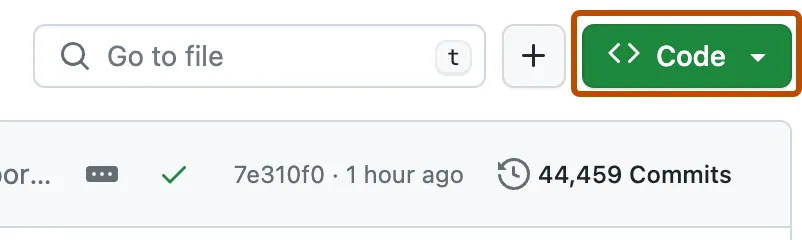
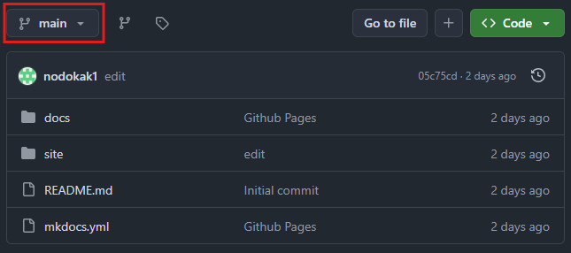

# Documentation
## Prerequisites

Ensure that you have git installed and configured. Refer to [Git](https://git-scm.com/downloads) for instructions to install.

## Steps

1. To clone the repository to create a local copy, follow the steps below:

    1. On GitHub, navigate to the main page of the repository.

    2. Above the list of files, click <> Code.

    

    3. Copy the URL for the repository. Under "HTTPS", click the copy icon.

    4. Open Powershell.

    5. Change the current working directory to your Downloads folder using `cd absolute\path\to\Downloads`. To get the absolute path, go to File Explorer, right click on Downloads and click 'Copy as Path'.

    6. Type `git clone`, then paste the URL you copied earlier.
        ```
        git clone https://github.com/YOUR-USERNAME/YOUR-REPOSITORY
        ```
    
    7. Press **Enter** to create your local clone.

2. If you are contributing to the documentation, ensure that a new branch is created before you begin. To create a branch, do one of the following:

- Using GitHub Interface

    - On GitHub, navigate to the main page and click on the button above the list of files as shown below:

        

    - Type in your desired branch name in the search bar. Ideally, use your first name as the name of your branch.

    - Click 'Create branch {branch_name} from main'.

- Using Terminal

    - In your terminal, use the code `git checkout -b NEW_BRANCH_NAME`.

    - To switch between branches, use `git checkout BRANCH_NAME`.

    - To check current branch, use `git branch`

3. Before you start working on the code, ensure you do the following each time before you start:

- Open Terminal.

- Check that you are on the right branch using `git branch`. Else, change to your own branch using `git checkout BRANCH_NAME`.

- Pull all changes from main to your own branch using `git pull origin main`.

## Installing Required Libraries

First, navigate to the root directory of the repository using `cd YOUR\PATH\TO\DOWNLOADS\Documentation`.

If you do not have mkdocs installed, open a terminal and install Material for MkDocs with `python pip install mkdocs-material`.

To install all required libraries, run `python -m pip install -r docs/requirements.txt`

## Committing Code

To contribute code to the main branch, follow these steps:

1. Open terminal:

    - Click on Terminal > New Terminal from the top menu.

2. Check the status of your changes:
    ```
    git status
    ```

    - This shows: 

        - Files that have been modified
        
        - Files that are untracked

        - Which branch you are currently on
    
    - Please save all files before the next step. To do so, Click on File > Save All from the top menu.

3. Before committing the changes to your branch, stage the files:

    - Stage all changed files:

        ```
        git add .
        ```

    - To stage specific files only:

        ```
        git add filename1 filename2
        ```

4. Commit your changes

    ```
    git commit -m "Your meaningful commit message here"
    ```

    - A good commit message should describe what you change. For instance, "Add user login form and validation".

5. Push your changes to GitHub

    ```
    git push origin your-branch-name
    ```

6. Create a Pull Request (PR)

    - Go to the GitHub repository in your browser.

    - You will see a banner offering to create a PR:

        - Click on "Compare & Pull Request".

    - Add a title and description of what the changes are.

    - Choose the correct base branch (main).

    - Click on Create pull request. Normally, other contributors will check the pull request and decide on whether to accept or reject the pull request.

## Launching Documentation Webpage

### Local

To see the website locally while making changes, use the code:

```
python -m mkdocs serve
```

A link to the website will be available in the last line. Click and launch the website locally.

### Public

To share with others, make sure you deploy the website. The website can be deployed as many times as you like, with the following code:

```
python -m mkdocs gh-deploy
```
