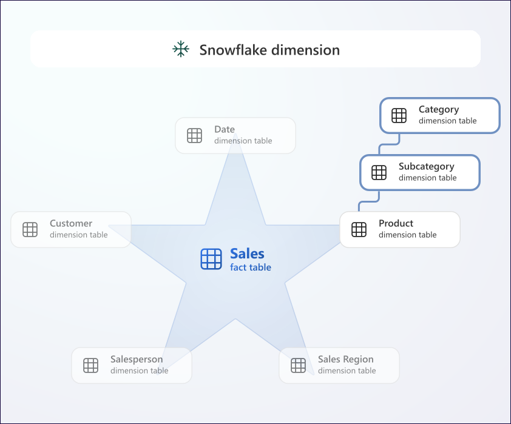
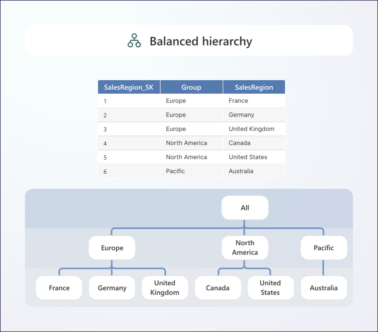
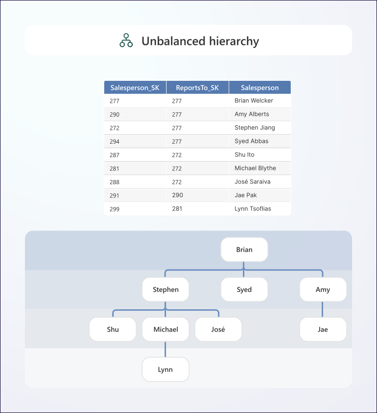
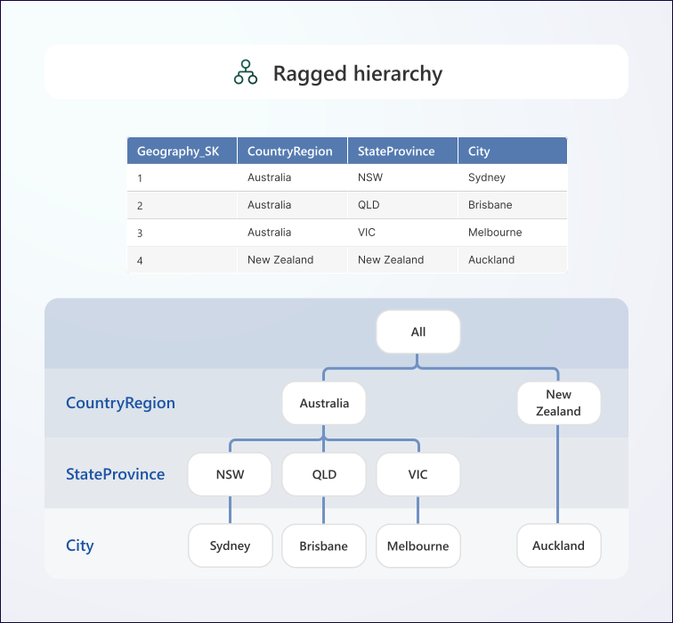
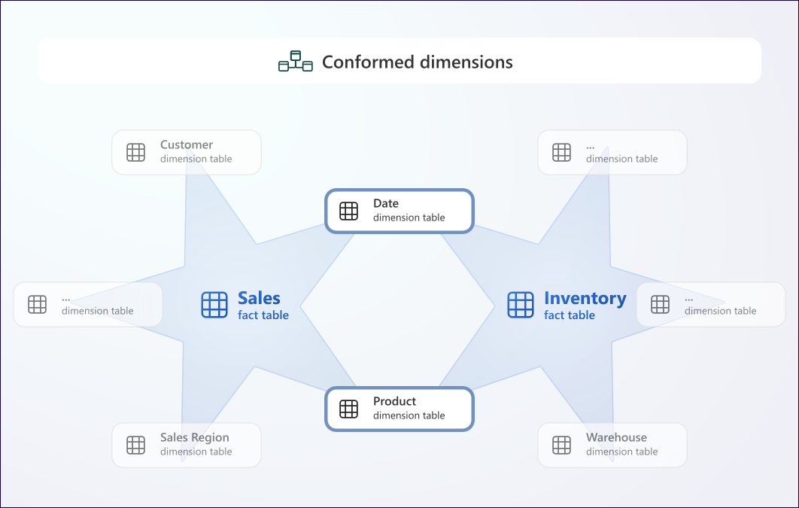
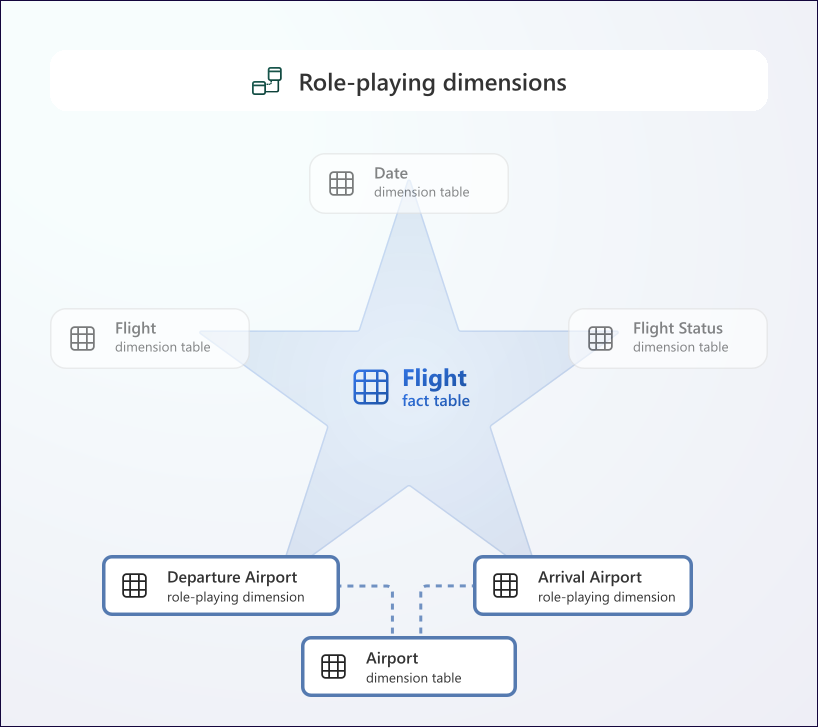
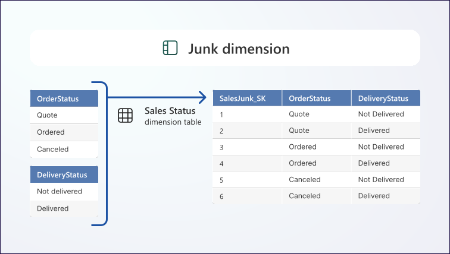
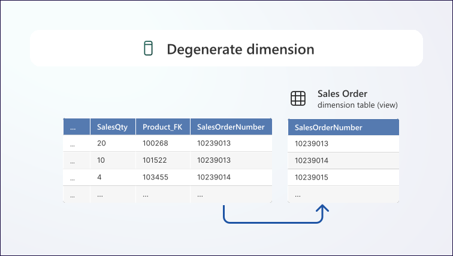
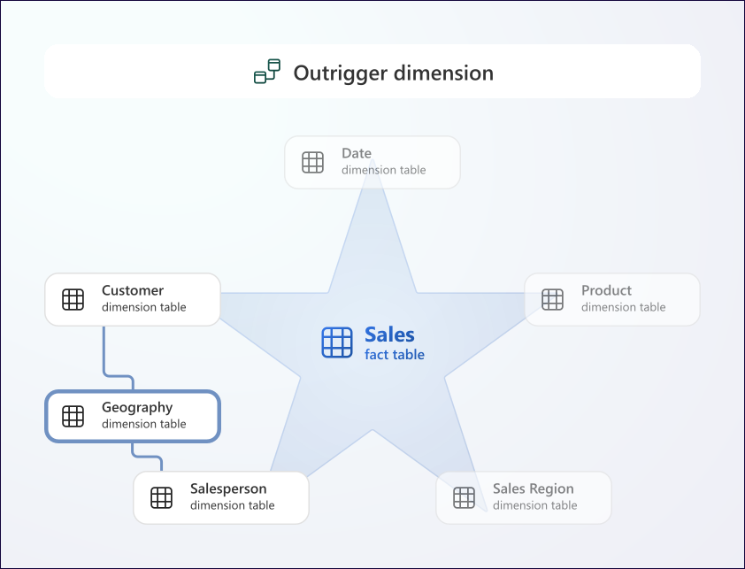
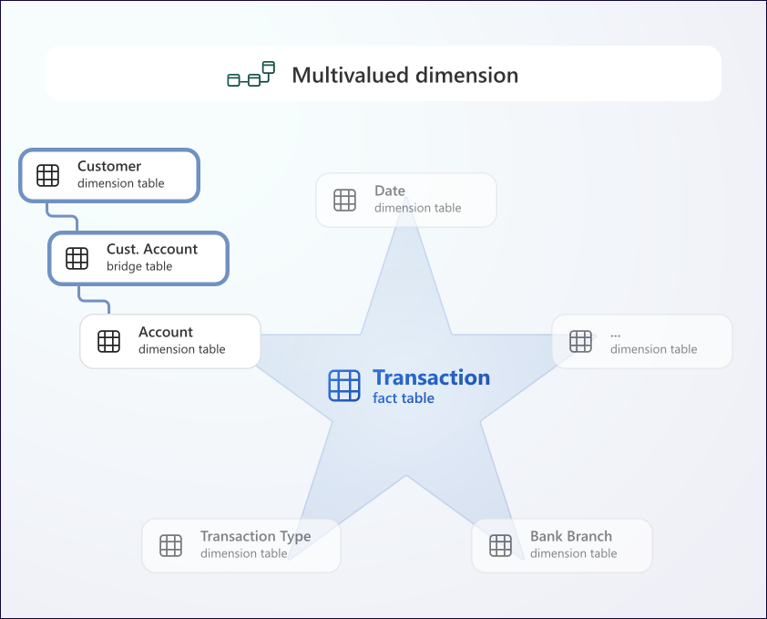

# Dimension Design

## Denormalization vs. Normalization

- It is almost alway sthe case that dimension tables should be denormalized. 

- **Normalization**: term used to describe data that's stored in a way that reduces repetitious data

- **Denormalization**: term used to define where precomputed redundant data exists.

    - Redundant data exists typically due to the storage of hierarchies, meaning that hierarchies are flattened.

    - E.g.: a product dimension could store subcategory (and its related attributes) and category (and its related attributes).

- Because dimensions are generally small (wen compared to fact tables), the cost of storing redundant data is almost always outweighed by the improved query performance and usability.

### Snowflake Dimensions

- One exception to denormalization is to design a snowflake dimension. 

    - A snowflake dimension is normalized, and it stores the dimension data across several related tables.

<figure markdown="span">

<figcaption>Snowflake Dimension (Microsoft, 2025)</figcaption>
</figure>

- Implement a snowflake dimension when:
    - The dimension is extremely large and storage costs outweigh the need for high query performance. 

    - You need keys to relate the dimension to higher-grain facts. For example, the sales fact table stores rows at product level, but the sales target fact table stores rows at subcategory level.

    - You need to track historical changes at higher levels of granularity.

- A hierarhcy in a Power BI semantic model can only be based on columns from a single semantic model table. Therefore, a snowflake dimension should deliver a denormalized result by using a view that joins the snowflake tables together.

## Hierarchies

- Hierarchies enable exploring data at distinct levels of summarization. 

    - For example, the initial view of a matrix visual might show yearlly sales, and the report consumer can choose to drill down to reveal quarterly and monthly sales.

- 3 ways to store a hierarchy in a dimension:

    - Columns from a single, denormalized dimension.

    - A snowflake dimension, which comprises multiple related tables.

    - A parent-child (self-referencing) relationship in a dimension.

- Hierarchies can be balanced, unbalanced, or ragged.

### Balanced Hierarchies

- Most common type of hierarchy.

- A balanced hierarchy has the same number of levels.

    - E.g.: A calendar hierarchy in a date dimension that comprises leels for year, quarter, month, and date.

- The following diagram depicts a balanced hierarchy for sales regions. It comprises two levels, which are sales region group and sales region.

    <figure markdown="span">
    
    <figcaption>Balanced Hierarchy (Microsoft, 2025)</figcaption>
    </figure>

- Levels of a balanced hierarchy are either based on columns from a single, denormalized dimension, or from tables that form a snowflake dimension.

    - When based on a single, denormalized dimension, the columns that represent the higher levels contain redundant data.

- For balanced hierarchies, facts always relate to a single level of the hierarchy, which is typically the lowest level.

    - The facts can be aggregated to the highest level of hierarchy. 

    - Facts can relate to any level, which is determined by the grain of the fact table. 

    - E.g.: the sales fact table might be stored at the date level, while the sales target fact table might be stored at quarter level.

### Unbalanced hierarchies

- An unbalanced hierarchy has levels based on a parent-child relationship. 

    - The number of levels in an unbalanced hierarchy is determined by the dimension rows, and not specific dimension table columns.

- A common example of an unbalanced hierarchy is an employe hierarchy where each row in an employee dimension relates to a reporting manager row in the same table.

    - In this case, any employee can be a manager with reporting employees.

    - Naturally, some branches of the hierarchy will have more levels than others.

- The following diagram comprises four levels, and each member in the hierarchy is a salesperson. Salespeople have a different number of ancestors in the hierarchy according to who they report to.

    <figure markdown="span">
    
    <figcaption>Unbalanced Hierarchy (Microsoft, 2025)</figcaption>
    </figure>

- Facts always relate to the dimension grain.

    - E.g.: sales facts relate to different salespeople, who have different reporting structures.

        - The dimension table would have a surrogate key (named `Salesperson_SK`) and a `ReportsTo_Salespersom_FK` foreign key column, which referecnes the primary key column.

        - Each salesperson without anyone to manage isn't necessarily at the lowest level of any branch of the hierarchy. 

        - When they're not at the lowest level, a salesperson might sell products and have reporting salespeople who also sell products. So, the rollup of fact data must consider the individual salesperson and all their descendants.

- Querying parent-child hierarchies can be complex and slow, especially for large dimensions.

    - In this case naturalizing the hierarchy is recommended. In this instance, naturalize means to transform and store the hierarchy levels in the dimension as columns.

### Ragged Hierarchies

- A ragged hierarchy occurs because the parent of a member in the hierarchy exists at a level that's not immediately above it. 

    - In these cases, missing level values repeat the value of the parent.

- Consider an example of a balanced geography hierarchy. A ragged hierarchy exists when a country/region has no states or provinces. 

    - For example, New Zealand has neither states nor provinces. So, when you insert the New Zealand row, you should also store the country/region value in the `StateProvince` column. 

    <figure markdown="span">
    
    <figcaption>Ragged Hierarchy (Microsoft, 2025)</figcaption>
    </figure>

## Calendar and Time

- Almost without exception, fact tables store measures at specific points in time. To support analysis by date (and possibly time), there must be calendar (date and time) dimensions.

- It's uncommon that a source system would have calendar dimension data, so it must be generated in the data warehouse. Typically, it's generated once, and if it's a calendar dimension, it's extended with future dates when needed.

### Date Dimension

- Most common dimension used for analysis. It stores one row per date, and it supports the common requirement to filter or group by specific periods of dates, like years, quarters, or months.

    - Date dimension should not go down to the time of day. If a day analysis is required, you should have both a date dimension and a time dimension. 

- The natural key of the date dimension should use the date data type. The surrogate key should store the date by using `YYYYMMDD` format and the int data type.

    - Storing `YYYYMMDD` as an int data type is not only efficient and sorted numerically, but it also conforms to the unambiguous International Standards Organization (ISO) 8601 date format.

## Conformed Dimensions

- Conformed dimensions relate to many fact tables, and so they're shared by multiple stars in a dimenional model. They deliver consistency and can help you to reduce ongoing development and maintenance.

- For example, it's typical that fact tables store at least one date dimension key (because activity is almost always recorded by date and/or time). For that reason, a date dimension is a common conformed dimension. You should therefore ensure that your date dimension includes attributes relevant for the analysis of all fact tables.

- The following diagram shows the `Sales` fact table and the `Inventory` fact table. Each fact table relates to the `Date` dimension and `Product` dimension, which are conformed dimensions.

    <figure markdown="span">
    
    <figcaption>Conformed Dimensions (Microsoft, 2025)</figcaption>
    </figure>

## Role-playing Dimensions

- When a dimension is referenced multiple times in a fact table, it's known as a role-playing dimension.

- For example, when a sales fact table has order date, ship date, and delivery date dimension keys, the date dimension relates in three ways. Each way represents a distinct role, yet there's only one physical date dimension.

- The following diagram depicts a `Flight` fact table. The `Airport` dimension is a role-playing dimension because it's related twice to the fact table as the `Departure Airport` dimension and the `Arrival Airport` dimension.

    <figure markdown="span">
    
    <figcaption>Role-playing Dimensions (Microsoft, 2025)</figcaption>
    </figure>

## Junk Dimensions

- Useful when there are many independent dimensions, especially when they comprise a few attributes (perhaps one), and when these attributes have low cardinality (few values). 

- The objective of a junk dimension is to consolidate many small dimensions into a single dimension. This design approach can reduce the number of dimensions, and decrease the number of fact table keys and thus fact table storage size. 

    - They also help to reduce Data pane clutter because they present fewer tables to users.

- A junk dimension table typically stores the Cartesian product of all dimension attribute values, with a surrogate key attribute.

- Good candidates include flags and indicators, order status, and customer demographic states (gender, age group, and others).

- The following diagram depicts a junk dimension named `Sales Status` that combines order status values and delivery status values.

    <figure markdown="span">
    
    <figcaption>Junk Dimension (Microsoft, 2025)</figcaption>
    </figure>

## Degenerate Dimensions

- A degenerate dimension can occur when the dimension is at the same grain as the related facts.

    - A common example of a degenerate dimension is a sales order number dimension that relates to a sales fact table. Typically, the invoice number is a single, non-hierarchical attribute in the fact table. So, it's an accepted practice not to copy this data to create a separate dimension table.

- The following diagram depicts a `Sales Order` dimension that's a degenerate dimension based on the `SalesOrderNumber` column in a sales fact table. This dimension is implemented as a view that retrieves the distinct sales order number values.

    <figure markdown="span">
    
    <figcaption>Degenerate Dimension (Microsoft, 2025)</figcaption>
    </figure>

- From a Power BI semantic modeling perspective, a degenrate dimension can be created as a separate table using Power Query.

## Outrigger Dimensions

- Outrigger dimension: when a dimension table relates to other dimension tables.

    - An outrigger dimension can help to conform and reuse definitions in the dimensional model.

- For example, you could create a geography dimension that stores geographic locations for every postal code. That dimension could then be referenced by your customer dimension and salesperson dimension, which would store the surrogate key of the geography dimension. That way, customers and salespeople could then be analyzed by using consistent geographic locations.

- The following diagram depicts a `Geography` dimension that's an outrigger dimension. It doesn't relate directly to the `Sales` fact table. Instead, it's related indirectly via the `Customer` dimension and the Salesperson dimension.

    <figure markdown="span">
    
    <figcaption>Outrigger Dimension (Microsoft, 2025)</figcaption>
    </figure>

- Consider that the date dimension can be used as an outrigger dimension when other dimension table attributes store dates. For example, the birth date in a customer dimension could be stored by using the surrogate key of the date dimension table.

## Multivalued Dimensions

- Multivalued dimension: when a dimension attribute must store multiple values.

- To implement a multivalued dimension, create a bridge table.

    - A bridge table stores a many-to-many relationship between entities.

- For example, consider there's a salesperson dimension, and that each salesperson is assigned to one or possibly more sales regions. In this case, it makes sense to create a sales region dimension. That dimension stores each sales region only once. A separate table, known as the bridge table, stores a row for each salesperson and sales region relationship. Physically, there's a one-to-many relationship from the salesperson dimension to the bridge table, and another one-to-many relationship from the sales region dimension to the bridge table. Logically, there's a many-to-many relationship between salespeople and sales regions.

- In the following diagram, the `Account` dimension table relates to the `Transaction` fact table. Because customers can have multiple accounts and accounts can have multiple customers, the `Customer` dimension table is related via the `Customer Account` bridge table.

    <figure markdown="span">
    
    <figcaption>Multivalued Dimension (Microsoft, 2025)</figcaption>
    </figure>

[:material-arrow-left: Star Schema Design](./star_schema.md){ .md-button }

[Fact Design :material-arrow-right:](./fact_design.md){ .md-button }

