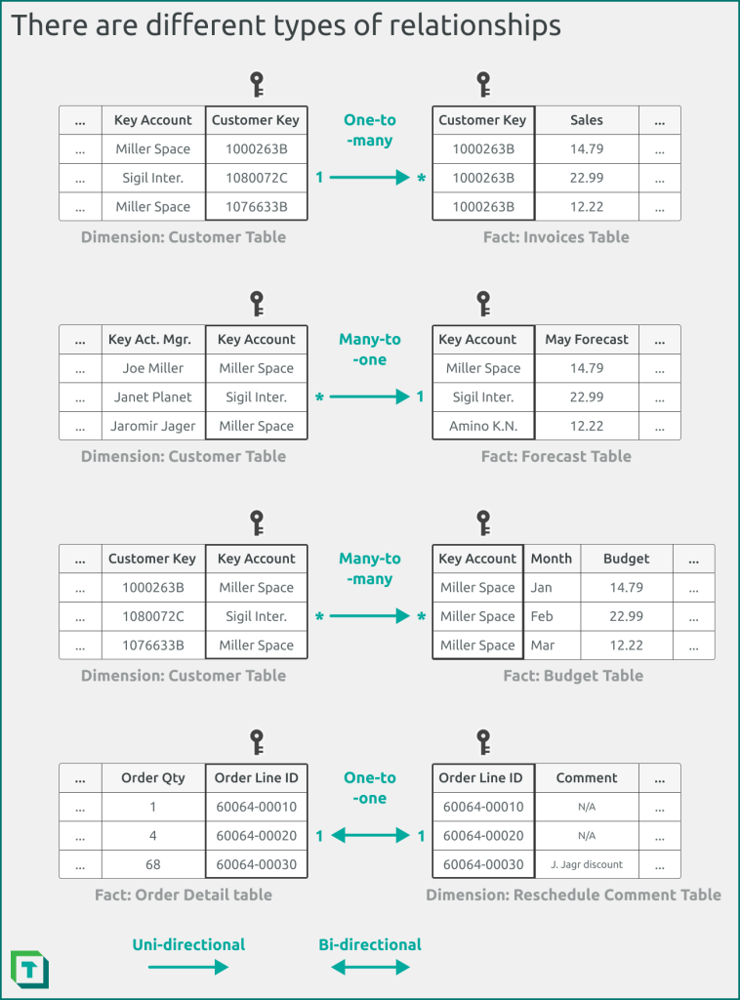

# Data Model Relationships

## What is a Relationship in a Data Model?

- **Relationship**: allows you to filter or group data from one table by columns in a second table. To do this, you match equivalent columns (or *keys*) from each table.

- Relationships are integral for you to shift from a set of disconnected data points to a functional model of a business process.

## Types of relationships

- Relationships are represented by arrows between tables in your model view.

    - You create a relationship between two columns, specifying the direction of the relationship and whether it's active, or not. 

- These in-memory data structures are conceptually similar to a SQL index, but differ in that they're a result of how the [VertiPaq](../power_bi/vertipaq.md) compresses and stores data in memory.

- The diagram below depicts the typical types of relationships in a Power BI data model.

    <figure markdown="span">
    
    <figcaption>Relationships (Tabular Editor, 2024)</figcaption>
    </figure>

### One-to-One Relationships

- Each record in the first table can have only one matching record in the second table, and each record in the second table can only have one matching record in the first table.

    - Usually, information like this is stored in the same table, so this type of relationship is not common.

- Use cases: 

    - Divide a table with many fields

    - Isolate part of a table for security reasons

    - Store information that applies only to a subset of the main table

- When this relationship is identified, both tables must share a common field.

### One-to-Many Relationships

- A one-to-many relationship in database design represents a connection where one entity can be linked to multiple instances of another entity, while each instance of the second enity can be linked to one instance of the first.

- Example: an order tracking database that includes a Customers table and an Orders table. A customer can place any number of orders. It follows that for any customer represented in the Customers table, there might be many orders represented in the Orders table. 

- To represent this relationship in database design:

    - Take the primary key on the "one" side of the relationship and add it as an additional field or fields to the table on the "many" side of the relationship.

    - In the previous example, you add a new field - the ID field from the Customers table - to the Orders table and name it Customer ID.

        - Access can then use the Customer ID number in the Orders table to locate the correct customer for each order.

### Many-to-Many Relationship

- Occurs when one or more records in one table are associated with one or more records in another table.

- Example:

    - Relationship between a Products table and an Orders table.

    - A single order can include more than one product. On the other hand, a single product can appear on many orders. Therefore, for each record in the orders table, there can be many records in the Products table. In addition, for each record in the Products table, there can be many records in the Orders table.

- Note that to detect existing many-to-many relationships between your tables, it is important that you consider both sides of the relationship.

- To represent a many-to-many relationship:

    - A third table must be created, often called a junction table, that breaks down the many-to-many relationship into two one-to-many relationships.

    - You insert the primary key from each of the two tables into the third table.

        - As a result, the thirs table records each occurrence, or instance, of the relationship.

    - From the example, the Orders table and the Products table have a many-to-many relationship that is defined by creating two one-to-many relationships to the Order Details table. One order can have many products, and each product can appear on many orders.

## Questions to Ask When Creating Relationships

- **Is the cardinality what you expect?** Most relationships should be one-to-many from the dimension to the fact table. If you intend to use a different cardinality, such as many-to-many or one-to-one, ensure that you are aware of the consequences for your model performance and query results.

- **Is the directionality what you expect?** Most relationships should be uni-directional from the dimension to the fact table. If you intend to use bi-directional relationships, ensure that you avoid ambiguity and are aware of the consequences for model performance and query results.

- **Is the relaionship active?** Most physical relationships should be active, unless you are using role-playing dimensions and activating the relationship by using the USERRELATIONSHIP DAX function inside of CALCULATE.

- **Are you missing keys?**: Relationships should ensure referential integrity to be valid, meaning that all of the values in the fact table (on the "to" or "many" side of a one-to-many relationship) have a corresponding value in the dimension table (on the "from" or "one" side of a one-to-many relationship). If you're missing keys, 

## Creating Relationships in Power BI Desktop

1. Open up Power BI Desktop, and [connect to the semantic model](../fabric_tools/semantic_model.md#connecting-to-semantic-model-in-power-bi-desktop) that you wish to create relationships for.

2. From the left pane, click on **Model view**.

    <figure markdown="span">
    
    </figure>

3. From here, you can create a relationship in Power BI Desktop in three ways:

    - **Drag-and-drop in model view**: Select the model view, find the tables, and drag the "from" ket column to the "to" key column. You can double-click any relationship to edit its properties.

    - **Relationship editor**: Select **Manage Relationships** from the top of the model view, and select **New...** to create a new relationship. You can also manage existing relationships.

    - **Automatically detect relationships**: Power BI Desktop will by default automatically detect relationships between similarly named and typed columns. You can adjust this behaviour from the Power BI Desktop options. Disabling automatic relationship detection is generally recommended when you're developing your semanic model by using Power BI Desktop, because it can result in unexpected relationships when you add new columns or modify the name and data types of existing columns.

4. Create relationships, ideally using the [star schema concept](./star_schema.md).

## Creating Relationships in Power BI Service

1. In Power BI Service, open the workspace that you wish to create your semantic model in. If there is no warehouse available to build the semantic model on, [create the warehouse](../fabric_tools/warehouse.md#creating-a-warehouse).

2. Select the **Reporting** tab of the ribbon and choose **New semantic model**. This enables you to create a new semantic model using only speciic tables and views from your data warehouse, for use by data teams and the business to build reports.

3. Navigate back to your workspace and confirm that you see your new semantic model. Notice that the type is **Semantic Model**, as opposed to the **Semantic model (default)** that is automatically created when you create a data warehouse.

    - *The default semantic model inherits the business logic from the parent Lakehouse or Warehouse. A semantic model that you create yourself is a custom model that you can design and modify according to your specific needs and preferences.*

4. Select **Open data model** from the ribbon.

5. Follow step 3 of [Creating Relationships in Power BI Desktop](#creating-relationships-in-power-bi-desktop).

[:material-arrow-left: Snowflake Schema](./snowflake.md){ .md-button }

[Naming Convention :material-arrow-right:](./naming_convention.md){ .md-button }

