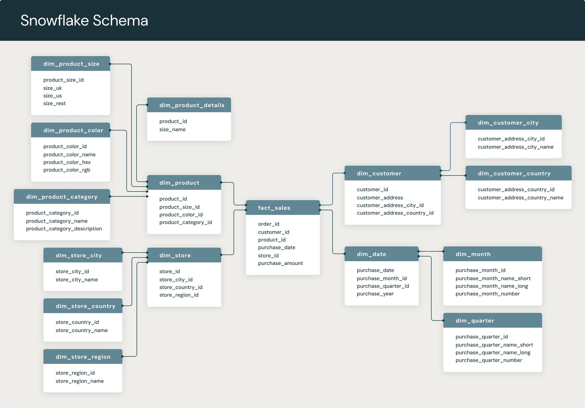

# Snowflake Schema

- A multi-dimensional dat amodel that is an extension of [star schema](./star_schema.md), where dimension tables are broken down into subdimensions. 

- Commonly used for business intelligence and reporting in [OLAP](../general_terminology/data_engineering.md#oltp-vs-olap) [data warehouses](../general_terminology/data_engineering.md#data-warehouse), [data marts](../general_terminology/data_engineering.md#data-mart), and [relational databases](../general_terminology/data_analytics.md#relational-database).

- It's called a snowflake schema because its entity-relationship diagram (ERD) looks like a snowflake, as seen below.

    <figure markdown="span">
    
    <figcaption>Snowflake Schema (Databricks)</figcaption>
    </figure>

- The snowflake structure materialized when thedimensions of a star schema are detailed and highly structured having several levels of relationship and the child tables have multiple parent tables.

    - The snowflake effect affects only the dimension tables and does not affect the fact tables.

- The dimension tables are normalized into multiple related tables, creating a hierarchical or "snowflake" structure.

- The fact table is still located at the center of the schema, surrounded by the dimension tables. However, each dimension table is further broken down into multiple related tables, creating a hierarchical structure that resembles a snowflake.

## What is Snowflaking?

- It is the result of further expansion and normalization of the dimension table. 

    - In other words, a dimension table is said to be snowflaked if the low-cardinality sttribute of the dimensions has been divided into separate normalized tables.

    - These tables are then joined to the original dimension table with referential constraints (foreign key constraint).

## When to Use Snowflake Schemas

- Storage optimization is critical.

- Data consistency and maintainability are priorities.

- there are complex, hierarchical dimensions.

## Snowflake Schema vs. Star Schema

- Like star schemas, snowflake schemas have a central [fact table](./fact_design.md) which is connected to multiple [dimension tables](./dimension_design.md) via [foreign keys](./star_schema.md#foreign-keys). However, the main difference is that they are more normalized than star schemas.

- Snowflake schemas offer more storage efficiency, due to their tighter adherence to high normalization standards, but query performance is not as good as with more denormalized data models. Denormalized data models like star schemas have more data redundancy (duplication of data), which makes query performance faster at the cost of duplicated data.

## Characteristics of Snowflake Schema

- The snowflake schema uses small disk space.

- It is easy to implement the dimension that is added to the schema.

- There are multiple tables, so performance is reduced.

- The dimension table consists of two or more sets of attributes that define information at different grains.

- The sets of attributes of the same dimension table are populated by different source systems.

## Features of the Snowflake Schema

- **Normalization**: The snowflake schema is a normalized design, which means that data is organized into multiple related tables. This reduces data redundancy and improves data consistency.

- **Hierarchical Structure**: The snowflake schema has a hierarchical structure that is organized around a central fact table. The fact table contains the measures or metrics of interest, and the dimension tables contain the attributes that provide context to the measures.

- **Multiple Levels**: The snowflake schema can have multiple levels of dimension tables, each related to the central fact table. This allows for more granular analysis of data and enables users to drill down into specific subsets of data.

- **Joins**: The snowflake schema typically requires more complex SQL queries that involve multiple tables joins. This can impact performance, especially when dealing with large data sets.

- **Scalability**: The snowflake schema is scalable and can handle large volumes of data. However, the complexity of the schema can make it difficult to manage and maintain.

## Advantages of Snowflake Schema

- It provides structured data which reduces the problem of data integrity.

- It uses small disk space because data are highly structured

## Disadvantages of Snowflake Schema

- Snowflaking reduces space consumed by dimension tables but compared with the tables entire data warehouse the saving is usually insignificant.

- Avoid snowflaking or normalization of a dimension table, unless required and appropriate.

- Do not snowflake hierarchies of dimension table into separate tables. Hierarchies should belong to the dimension table only and should never be snowflakes.

- Multiple hierarchies that can belong to the same dimension have been designed at the lowest possible detail.

[:material-arrow-left: Fact Design](./fact_design.md){ .md-button }

[Data Model Relationships :material-arrow-right:](./relationships.md){ .md-button }

