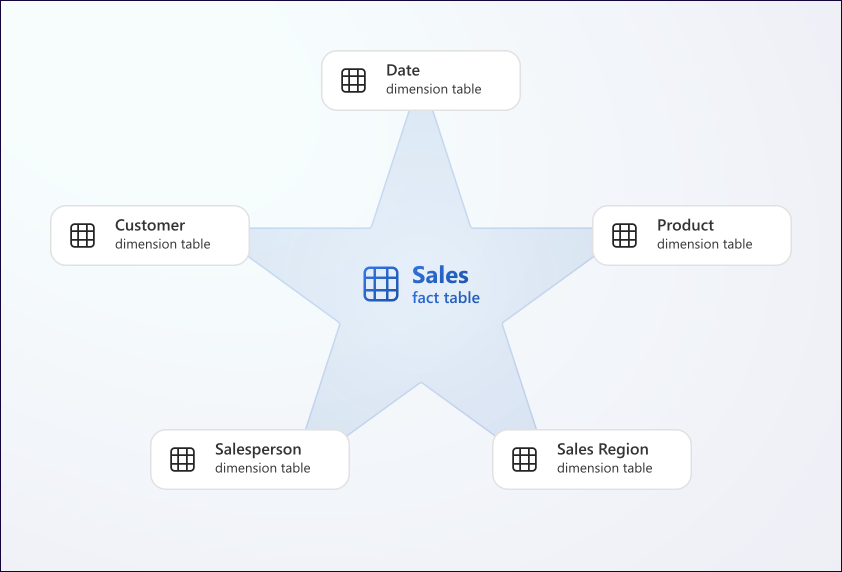

# Star Schema Design

- A dimensional modelling design technique adopted by relational data warehouses.

-  It's a recommended design approach to take when creating a [Fabric Warehouse](../fabric_tools/warehouse.md).

- A star schema comprises fact tables and dimension tables.

    - **Dimension tables**: describe the entities relevant to the organization and analytics requirements. Broadly, they represent the things that you model. Things could be products, people, places, or any other concept, including date and time.

    - **Fact tables**: store measurements associated with observations or events. They can store sales orders, stock balances, exchange rates, temperature readings, and more. Fact tables contain dimension keys together with granular values that can be aggregated.

- It is optimized for analytic query workloads, and is thus considered a prerequisite for enterprise Power BI [semantic models](../fabric_tools/semantic_model.md).

    - Analytic queries are concerned with filtering, grouping, sorting, and summarizing data.

    - Fact data is summarized within the context of filters and groupings of the related dimension tables.

- The reason why it's called a star schema is because a fact table forms the center of a star while the related dimension tables form the points of the star.

    <figure markdown="span">
    
    <figcaption>Star Schema (Microsoft, 2025)</figcaption>
    </figure>

- A star schema often contains multipe fact tables, and therefore multiple stars.

- A well-desgned star schema delivers high performance (relational) queries because of fewer table joins, and the higher likelihood of useful indexes. Also, a star schema often requires low maintenance as the data warehouse design evolves. For example, adding a new column to a dimension table to support analysis by a new attribute is a relatively simple task to perform. As is adding new facts and dimensions as the scope of the data warehouse evolves.

## Dimension Table Structure

- To easily identify dimension tables, their names will be prefixed with `Dim`.

- To describe the structure of a dimension table, consider the following example of a salesperson dimension table named `Dim_Salesperson`. This example applies good design practices.

```SQL
CREATE TABLE Dim_Salesperson
(
    --Surrogate key
    Salesperson_SK INT NOT NULL,
    
    --Natural key(s)
    EmployeeID VARCHAR(20) NOT NULL,
    
    --Dimension attributes
    FirstName VARCHAR(20) NOT NULL,
    <...>
    
    --Foreign key(s) to other dimensions
    SalesRegion_FK INT NOT NULL,
    <...>
    
    --Historical tracking attributes (SCD type 2)
    RecChangeDate_FK INT NOT NULL,
    RecValidFromKey INT NOT NULL,
    RecValidToKey INT NOT NULL,
    RecReason VARCHAR(15) NOT NULL,
    RecIsCurrent BIT NOT NULL,
    
    --Audit attributes
    AuditMissing BIT NOT NULL,
    AuditIsInferred BIT NOT NULL,
    AuditCreatedDate DATE NOT NULL,
    AuditCreatedBy VARCHAR(15) NOT NULL,
    AuditLastModifiedDate DATE NOT NULL,
    AuditLastModifiedBy VARCHAR(15) NOT NULL
);
```

### Primary Key

- **Primary Key**: a column or columns in a database table with values  that uniquely identify each row or record.

    - E.g.: an employee ID column could be a primary key in a table of employee information.

- Characteristics:

    - No null values

    - No duplicate values

    - May take the form of an existing column in a table (natural key) or be added as a new column (surrogate key)

    - May inclue a single column or multiple columns (as a composite primary key)

- Create a Microsoft Fabric Warehouse table with a primary key:

    ```SQL
    CREATE TABLE PrimaryKeyTable (c1 INT NOT NULL, c2 INT);

    ALTER TABLE PrimaryKeyTable ADD CONSTRAINT PK_PrimaryKeyTable PRIMARY KEY NONCLUSTERED (c1) NOT ENFORCED;
    ```

### Surrogate Key

- In the example, the surrogate key is `Salesperson_SK`.

- **Surrogate Key**: a single column unique-identifier that's generated and stored in the dimension table. 

    - It's a primary key column used to relate to other tables in the dimensional model.

- Surrogate keys strive to insulate the data warehouse from changes in source data. They also deliver many other benefits, allowing you to:

    - Consolidate multiple data sources (avoiding clash of duplicate identifiers).

    - Consolidate multi-column natural keys into a more efficient, single-column key.

    - Limit fact table width for storage optimization (by selecting the smallest possible integer data type).

- A surrogate key column is a recommended practice, even when a natural key (described next) seems an acceptable candidate. You should also avoid giving meaning to the key values (except for date and time dimension keys, as described later).

### Natural Keys

- In the sample dimension table, there is also a natural key, which is named `EmployeeID`.

- A natural key is the key stored in the source system.

- It allows relating the dimension data to its source system, which is typically done by an Extract, Load, Transform (ETL) process to load the dimension table.

- Sometimes dimensions don't have a natural key. That oculd be the case for your date dimension or lookup dimensions, or when you generate dimension data by normalizing a flat file.

### Dimension Attributes

- The sample dimension table also has dimension attributes, like the `FirstName` column.

- Dimension attributes provide context to the numeric data stored in related fact tables. They're typically text columns that are used in analytics queries to filter and group (slice and dice), but not to be aggregated themselves. 

### Foreign Keys

- The sample dimension table also has a foreign key, which is named `SalesRegion_FK`.

- Other dimension tables can reference a foreign key, and their presence in a dimension table is a special case. 

    - It indicates that the table is related to another dimension table, meaning that it might form a part of a snowflake dimension or it's related to an outrigger dimension.

## Fact Table Structure

- Fact tables include measures, which are typically numeric columns, like sales order qunatity. Analytics queries summarize measures (by using sum, count, average, and other functions) within the context of dimension filters and groupings.

- Fact tables also include dimension keys, which determine the dimensionality of the facts. The dimension key values determine the granularity of the facts, which is the atomic level by which facts are defined.

- To easily identify fact tables, their names will be prefixed with `Fact_`.

- To describe the structure of a fact table, consider the following example of a sales fact table named `Fact_Sales`. This example applies good design practices. 

```SQL
CREATE TABLE Fact_Sales
(
    --Dimension keys
    OrderDate_Date_FK INT NOT NULL,
    ShipDate_Date_FK INT NOT NULL,
    Product_FK INT NOT NULL,
    Salesperson_FK INT NOT NULL,
    <...>
    
    --Attributes
    SalesOrderNo INT NOT NULL,
    SalesOrderLineNo SMALLINT NOT NULL,
    
    --Measures
    Quantity INT NOT NULL,
    <...>
    
    --Audit attributes
    AuditMissing BIT NOT NULL,
    AuditCreatedDate DATE NOT NULL,
    AuditCreatedBy VARCHAR(15) NOT NULL,
    AuditLastModifiedDate DATE NOT NULL,
    AuditLastModifiedBy VARCHAR(15) NOT NULL
);
```

### Primary Key

- The sample fact table does not have a primary key. 

    - It doesn't typically serve a useful purpose, and it would unnecessarily increase the table storage size.

    - A primary key is often implied by the set of dimension keys and attributes.

### Dimension Key

- The sample fact table has various dimension keys, which determine the dimensionality of the fact table. 

- Dimension keys are references to the surrogate keys (or higher-level attributes) in the related dimensions.

- A fact table can reference a dimension multiple times. In this case, it's known as a [role-playing dimension](./dimension_design.md#role-playing-dimensions). In this example, the fact table has the `OrderDate_Date_FK` and `ShipDate_Date_FK` dimension keys. Each dimension key represents a distinct role, yet there's only one physical date dimension.

- It is good practice to set each dimension key as `NOT NULL`.

### Attributes

- In this example, attribute columns store sales order information.

- Attributes provide additional information and set the granularity of fact data, but they're neither dimension keys nor dimension attributes, nor measures.

- For analysis purposes, an attribute could form a [degenerate dimension](./dimension_design.md#degenerate-dimensions).

### Measures

- The `Quantity` column in the sample fact table is an example of a measure.

- Measure columns are typically numeric and commonly additive (meaning they can be summed, and summarized by using other aggregations).

### Audit Attributes

- The sample fact table also has various audit attributes. Audit attributes are optional.

- They allow you to track when and how fact records were created or modified, and they can include diagnostic or troubleshooting information raised during Extract, Transform, and Load (ETL) processes.

    - For example, you'll want to track who (or what process) updated a row, and when. Audit attributes can also help diagnose a challenging problem, like when an ETL process stops unexpectedly.

<div style="display: flex; justify-content: flex-end; gap: 0.5rem;" markdown="1">
[Dimension Design :material-arrow-right:](./dimension_design.md){ .md-button }
</div>