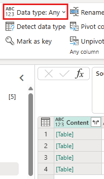

# Dataflow

- Because most of our files are currently stored in Sharepoint, this is the default method used to bring data into Fabric workspaces.

- Power Query is used to do the data transformation, thus it is a low-code solution.

## Dataflow Gen1 vs. Gen2

- In the current workspaces, there are 2 different dataflows being used: Dataflow Gen1 and Dataflow Gen2.

- The only difference between the two dataflows is that Gen2 allows for a different source and destination (e.g. warehouse, lakehouse, etc.), but Gen1 only allows for one destination, which is a semantic model.

## Creating a Dataflow (Sharepoint Files)

1. In the workspace that you want to create a dataflow, click on **+ New Item**.

2. Under **Get data**, click on the **Dataflow Gen2** tile. 

3. Name your Dataflow Gen2, and select **Create**.

    - If you wish to enable Git integration, select teh checkbox below the Name textbox.

    - For the accurate Naming Convention, refer to [Architecture: Naming Convention](../architecture/naming_convention.md).

4. Under the **Home** tab, click on the **Get Data** button, and a dropdown should appear.

    <figure markdown="span">
    
    </figure>

5. Click on **More...**. Under **New Sources**, select **Sharepoint folder**. If it is not under **New sources**, you can simply search for it in the search bar.

    - If you want to bring in data from other sources besides Sharepoint files, you can select oter sources besides Sharepoint folder here.

    <figure markdown="span">
    
    </figure>

6. Enter the desired Sharepoint Site URL. 

    - To get the Sharepoint site URL:

        - Open a page in Sharepoint.

        - From a page in Sharepoint, you can usually get the site address by selecting **Home** in the navigation pane, or the icon for the site at the top. Copy the address from your web browser's address bar and paste into the **Sharepoint Site URL** text box.'

    <figure markdown="span">
    
    <figcaption>Sharepoint Site URL (Microsoft, 2025)</figcaption>
    </figure>

7. Click **Next**.

8. In the **Preview folder data** popup, click **Create**.

9. Create 3 groups, "NAVIGATION", "TRANSAFORMATION", and "FINAL".

    - To do so, right click on any empty space in the **Queries** pane, and select **New group**.

    - **NAVIGATION**: for all the files used to navigate to the destination.

    - **TRANSFORMATION**: for all the "Transform file from ___" folders created when combining files.

        - If you are not combining files, this folder can stay empty.

    - **FINAL**: for all the final files that will be sent to the data destination.

10. Rename this query to from "Query" to "Source". To do this, in the **Queries** pane, right click on the query and select **Rename**.

11. Right click on the query and click **Enable staging** to disable staging.

    - Please remember to disable staging for all files that will not be sent to the data destination. Only files that will be sent to the data destination can have staging enabled.

12. In the Formula textbox, the current code should be ```SharePoint.Files("your/sharepoint/site/url", [ApiVersion = 15])```. Change this code to ```SharePoint.Contents("your/sharepoint/site/url", [ApiVersion = 15])```.

13. Put the **Source** query under the NAVIGATION folder.

    - Your Queries pane should now look like this.

    <figure markdown="span">
    
    </figure>

14. Reference the **Source** query by right clicking on the **Source** query and selecting **Reference**.

    - From here, navigate to the folder where all your files are located.

    - Generally, if there are multiple folders where the files are located, a good practice would be to stop at the parent folder where all the individual folders are located. Then, reference the parent folder and navigate to each of the desired folders. A query can be referenced multiple times, thus if you have multiple folders to navigate to, just reference the parent folder multiple times.

    - To navigate into the folder, simply click on the **[Table]** Link under the **Content** column in the table.

    - All of these queries go into the NAVIGATION folder.

    - Rename all these queries to the names of the folders that you are navigating to.

15. A good practice would be to rename all the invidual steps to what you are currently doing. This can be done by right clicking the individual steps and selecting **Rename**. All the steps are under the **Query settings** pane, under **Applied steps**.

16. Once you are in the folder, reference the query again. This time, move the referenced query to the FINAL folder. Name this new referenced query to the table name that you want to save it as in your data destination.

17. If you have multiple files that you want to combine together, follow the steps below for the new query:

    - Change the data type of the column to Binary. Ensure that the items are all files, and not folders. There will be an error if they are folders. If it is successful, the **[Table]** links will change to **[Binary]**.

        - To change the data type, click on the data type beside the **Content** column header.

            <figure markdown="span">
            
            </figure>

        - Alternatively, go to the **Transform** pane, select the column, and click on **Data type: Any** and change to Binary in the dropdown.

            <figure markdown="span">
            
            </figure>
        
    - Click on the **Combine files** button on the right side of the **Content** column header.

        <figure markdown="span">
        
        </figure>

    - If there are multiple sheets, select the sheet that you want to combine from the left pane in the **Combine files** popup. Once done, select **OK**.

    - Move the "Transform file from {Table Name}" to the TRANSFORMATION folder.

18. Do the necessary data transformations to the query. 

    - If this data is fed into EDITable, make sure that the general structure of the table remains the same. This means that only basic transformations such as removing empty rows and changing data types can be done.

    - If you want to make changes that will change each individual combined files, do the transformations in the **Transform Sample file** file in the "Transform file from {Table Name}" folder.

        - Once the changes are made, remember to refresh the query, which is available under the **Home** pane.

        - The changes made in the **Transform Sample file** file should now be reflected in the main query.

    - If you want to make changes to the overall main query, simply do the transformations in the main query.

19. Once all the transformations are done, add the data detsination. Under the **Query settings** pane, press the **+** sign beside **Data destination**.

    <figure markdown="span">
    
    </figure>

20. Select the new destination type that you wish to bring the table to.

21. Find the exact destination that you want to bring the table to in the **Choose destination target** popup. Click **Next** once done.

22. Unselect **Use Automatic Settings**, set update method to **Replace**, and schema options on publish to **Dynamic schema**.

23. For column mapping, if a warning appears that some column names contain unsupported characters, click the **Fix it** button.

24. Check that all Source types are defined, the source type cannot be Any. 

25. Once all the columns are selected, click **Save settings**.

26. Click **Publish** once all the configurations (steps 15 - 25) are done for all queries. 

## Maintaining Dataflows

- A scheduled refresh can be set on the dataflow such that the data in the dataflow will be refreshed periodically.

- By using pipelines, a refresh can be scheduled when data is added to the Sharepoint folder.

- A manual refresh can be done by clicking the refresh button on the dataflow.

    <figure markdown="span">
    
    </figure>

<div style="display: flex; justify-content: space-between;" markdown="1">

[:material-arrow-left: SQL Database](./sql_database.md){ .md-button }

[Pipelines :material-arrow-right:](./pipelines.md){ .md-button }

</div>