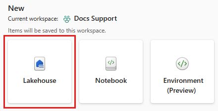
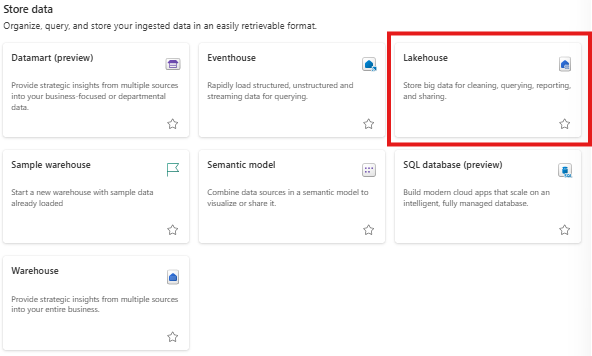
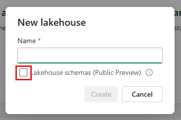
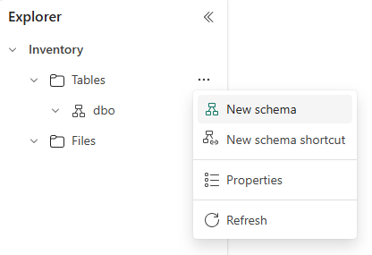
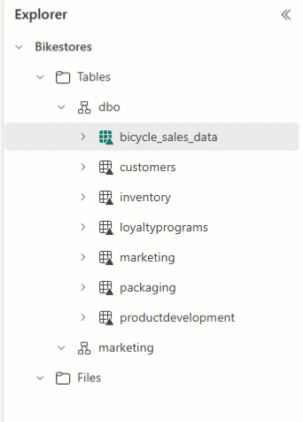
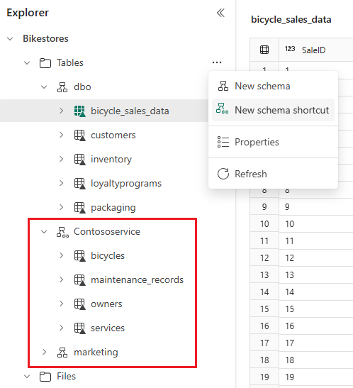
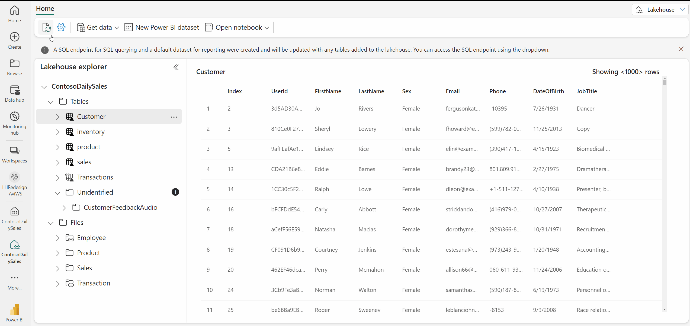

# Lakehouse

## Creating a Lakehouse

There are 2 ways to create a Lakehouse. However, the 2nd method is more straightforward, and usually preferred.

1. Data Engineering homepage
    - A Lakehouse can be created through the Lakehouse card under the 'New' section in the homepage.

    <figure markdown="span">
    
    <figcaption>Lakehouse Explorer in Fabric (Microsoft, 2025)</figcaption>
    </figure>

2. Workspace view
    - A Lakehouse can be created in the workspace view under 'Store Data'

    <figure markdown="span">
    
    <figcaption>Lakehouse card in Workspace view</figcaption>
    </figure>

### Creating a Lakehouse in Data Engineering homepage

1. Browse to the Data Engineering homepage

2. Under the 'New' section, locate the Lakehouse card and select it to get started with the creation process.

3. Enter the name for the Lakehosue and a sensitivity label if required, and select 'Create'.

4. Once the Lakehouse is created, you land on the Lakehouse explorer page where you can get started and load data.

### Creating a Lakehouse in Workspace view

1. Navigate to the workspace that you want to create a Lakehouse.

2. In the top left hand corner, click on the 'New Item' button. A 'New Item' pane should pop up on the right half of the screen.

3. Navigate to the 'Store Data' section of the 'New Item' pane.

4. Click on 'Lakehouse', and it should prompt you to name the Lakehouse, and select 'Create' once the Lakehouse is named. 
    - To enable schema support for the Lakehouse, check the box nect to Lakehouse schemas (Public Preview).

    <figure markdown="span">
    
    </figure>

5. Once the Lakehouse is created, you should end up in the Lakehouse explorer.


#### Lakehouse Schemas

- Once the Lakehouse is created, the default schema named **dbo** can be found under 'Tables'. This schema can't be changed or removed.

- To create a new schema, hover over 'Tables' in Lakehouse Explorer, select ..., and choose 'New schema'. Enter the schema name and select 'Create'. The schema will be listed under 'Tables' in alphabetical order.

    <figure markdown="span">
    
    </figure>

    - To use Python to store a table in a specific schema, use the following code:

    === "PySpark"
    ```python
    df.write.mode("overwrite").saveAsTable("yourSchemaName.yourTableName")
    ```

    - Alternatively, you can drag and drop tables between schemas in the Lakehouse Explorer page.

    <figure markdown="span">
    
    </figure>

- To reference an entire schema from another Fabric Lakehouse or external storage, hover over 'Tables' in Lakehouse Explorer, select ..., and choose 'New schema shortcut'. Then, select a schema on another Lakehouse, or a folder with Delta tbales on your external storage. This will create a new schema with the referenced tables.

<figure markdown="span">

</figure>

## Loading data into Lakehouse
- Local file/folder upload: Upload data from your local machine directl to the File section of your lakehouse.

- Notebook code:

## Interacting with Lakehouses

- **Lakehouse explorer**: This is the main Lakehouse interaction page. You can load data into the Lakehouse, explore data in the Lakehouse using the object explorer, and various other things.
- **Notebooks**: Notebooks can be used to write code to read, transform and write directly to Lakehouse as tables and/or folders.
- **Pipelines**: Data integration tools such as pipeline copy tool to pull data from other sources and land into the Lakehouse can be used.

- **Dataflows Gen 2**: These can be used to ingest and prepare data.
    - Use this if you are importing data from Sharepoint folder.

### Lakehouse Explorer

<figure markdown="span">
  
  <figcaption>Lakehouse Explorer in Fabric (Microsoft, 2025)</figcaption>
</figure>

- **Table Section**: All tables are stored here.
    - Organised and governed to facilitate efficient data processing and analysis.
    - You can select a table to preview, inspect the table schema, access underlying files, and execute various other actions related to the data.

- **Unidentified Area**: Displays folders or files present in the managed area that lack associated tables in SyMS.
    - If this happens when you create new tables: Refresh the 'Unidentified' folder, and the tables should appear under the 'Tables' folder.
    - If unsupported files (e.g.: images, audio) are uploaded to the managed area, they will not be automatically detected and linked to tables.
        - Prompts the user to either remove these files from the managed area or transfer them to the File Section for further processing. 

- **File Section**: Unamanged area of the lakehouse and can be considered a "landing zone" for raw data ingested from various sources.
    - The data often requires additional processing. 
    - Displays folder-level objects only. To view file-level objects, you need to utilize the Main View area.


<div style="display: flex; justify-content: space-between;" markdown="1">

[:material-arrow-left: Overview](../fabric_tools.md){ .md-button }

[Notebook :material-arrow-right:](./notebook.md){ .md-button }

</div>
