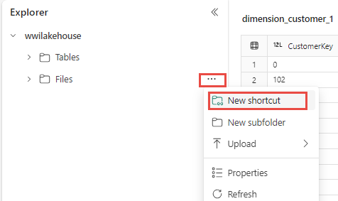

# Lakehouse

## Creating a Lakehouse

*To decide between the different data storage options, refer to [Warehouse, SQL Database, or Lakehouse?](../terminology/store_data.md#warehouse-sql-database-or-lakehouse)*

There are 2 ways to create a Lakehouse. However, the second method is more straightforward, and usually preferred.

1. Data Engineering homepage

    - A Lakehouse can be created through the Lakehouse card under the **New** section in the homepage.

    <figure markdown="span">
    
    <figcaption>Lakehouse Explorer in Fabric (Microsoft, 2025)</figcaption>
    </figure>

2. Workspace view

    - A Lakehouse can be created in the workspace view under 'Store Data'

    <figure markdown="span">
    
    <figcaption>Lakehouse card in Workspace view</figcaption>
    </figure>

### Creating a Lakehouse in Data Engineering homepage

1. Browse to the Data Engineering homepage

2. Under the **New** section, locate the Lakehouse card and select it to get started with the creation process.

3. Enter the name for the Lakehosue and a sensitivity label if required, and select **Create**.

4. Once the Lakehouse is created, you land on the Lakehouse explorer page where you can get started and load data.

### Creating a Lakehouse in Workspace view

1. Navigate to the workspace that you want to create a Lakehouse.

2. In the top left hand corner, click on the **New Item** button. A **New Item** pane should pop up on the right half of the screen.

3. Navigate to the **Store Data** section of the 'New Item' pane.

4. Click on **Lakehouse**, and it should prompt you to name the Lakehouse, and select **Create** once the Lakehouse is named.

    - To enable schema support for the Lakehouse, check the box nect to Lakehouse schemas (Public Preview).

    <figure markdown="span">
    
    </figure>

5. Once the Lakehouse is created, you should end up in the Lakehouse explorer.


#### Lakehouse Schemas

- Once the Lakehouse is created, the default schema named **dbo** can be found under **Tables**. This schema can't be changed or removed.

- To create a new schema, hover over **Tables** in Lakehouse Explorer, select ..., and choose **New schema**. Enter the schema name and select **Create**. The schema will be listed under **Tables** in alphabetical order.

    <figure markdown="span">
    
    </figure>

    - To use Python to store a table in a specific schema, use the following code:

    === "PySpark"
    ```python
    df.write.mode("overwrite").saveAsTable("yourSchemaName.yourTableName")
    ```

    - Alternatively, you can drag and drop tables between schemas in the Lakehouse Explorer page.

    <figure markdown="span">
    
    </figure>

- To reference an entire schema from another Fabric Lakehouse or external storage, hover over **Tables** in Lakehouse Explorer, select ..., and choose **New schema shortcut**. Then, select a schema on another Lakehouse, or a folder with Delta tables on your external storage. This will create a new schema with the referenced tables.

<figure markdown="span">

</figure>

## Loading data into Lakehouse

In our current workspaces, these methods are most commonly used:

- **[Notebook](./notebook.md) code**: In the Finance dataflows, the following code is used:

    === "PySpark"
    ```python
    yourDataframeName.write.mode("overwrite").format("delta").option("overwriteSchema", "true").saveAsTable("targetLakehouse.yourTableName")
    print("yourTableName saved to Lakehouse")
    spark.catalog.clearCache()
    spark.sql("REFRESH TABLE targetLakehouse.yourTableName")
    ```

- **Copy tool in [pipelines](./pipelines.md)**: Connect to various data sources and land the data in its original format or convert it into a Delta table.

- [**Dataflows Gen 2**](./dataflow.md): Create dataflows to import data, transform it, and publish it into your lakehouse.

    - Use this if you are importing data from a Sharepoint folder.

- [**Shortcut**](#shortcut): Create shortcuts that connect to existing data in your lakehouse without needing to copy it.

## Interacting with Lakehouses

- [**Lakehouse explorer**](#lakehouse-explorer): This is the main Lakehouse interaction page. You can load data into the Lakehouse, explore data in the Lakehouse using the object explorer, and various other things.

- [**Notebooks**](./notebook.md): Notebooks can be used to write code to read, transform and write directly to Lakehouse as tables and/or folders.

## Lakehouse Explorer

<figure markdown="span">
  
  <figcaption>Lakehouse Explorer in Fabric (Microsoft, 2025)</figcaption>
</figure>

- **Table Section**: All tables are stored here.

    - Organised and governed to facilitate efficient data processing and analysis.

    - You can select a table to preview, inspect the table schema, access underlying files, and execute various other actions related to the data.

- **Unidentified Area**: Displays folders or files present in the managed area that lack associated tables in SyMS.

    - If this happens when you create new tables: Refresh the **Unidentified** folder, and the tables should appear under the **Tables** folder.

    - If unsupported files (e.g.: images, audio) are uploaded to the managed area, they will not be automatically detected and linked to tables.

        - Prompts the user to either remove these files from the managed area or transfer them to the File Section for further processing. 

- **File Section**: Unmanaged area of the lakehouse and can be considered a "landing zone" for raw data ingested from various sources.

    - The data often requires additional processing. 

    - Displays folder-level objects only. To view file-level objects, you need to utilize the Main View area.

### Main View Area

- This is where most of the data interaction occurs. The view changes depending on what you select.

- The object explorer only displays the folder hierarchy of the lake, but the main view area is used to navigate the files, preview files and tables, and various other tasks.

#### Table Preview

- Some functions can be carried out in the preview area to interact with the data:

    - Sort columns in ascending or descending order with a simple click.

    - Filter data by substring or by selecting from a list of available values in the table.

    - Resize columns to tailor your data view to suit your preferences.

#### File Preview

- Files in various formats can be previewed. This is supported for the following file types: **bmp, css, csv, gif, html, jpeg, jpg, js, json, md, mjs, png, ps1, py, svg, ts, tsx, txt, xml,yaml**.

## Shortcut

- Shortcuts can be created between lakehouses and/or warehouses, such that data does not need to be copied.

- You can quickly make large amounts of data available in your lakehouse locally without the latency of copying data from the source.

### Creating a Shortcut

<figure markdown="span">

<figcaption>Create lakehouse Shortcut (Microsoft, 2025)</figcaption>
</figure>

1. Open Lakehouse Explorer in the lakehouse that you want to copy.

2. Select the ... symbol next to the **Tables** or **Files** section and select **New shortcut**.

    - The **Tables** section of the lakehouse explorer automatically registers it as a table enabling data access through Spark, SQL analytics endpoint, and default semantic model.

    - After a shortcut is created, you can differenciate a regular file or a table from the shortcut from its properties. The properties have a **Shortcut Type** parameter that indicates the item is a shortcut.


<div style="display: flex; justify-content: flex-end; gap: 0.5rem;" markdown="1">
[SQL Analytics Endpoint :material-arrow-right:](./sql_endpoint.md){ .md-button }
</div>