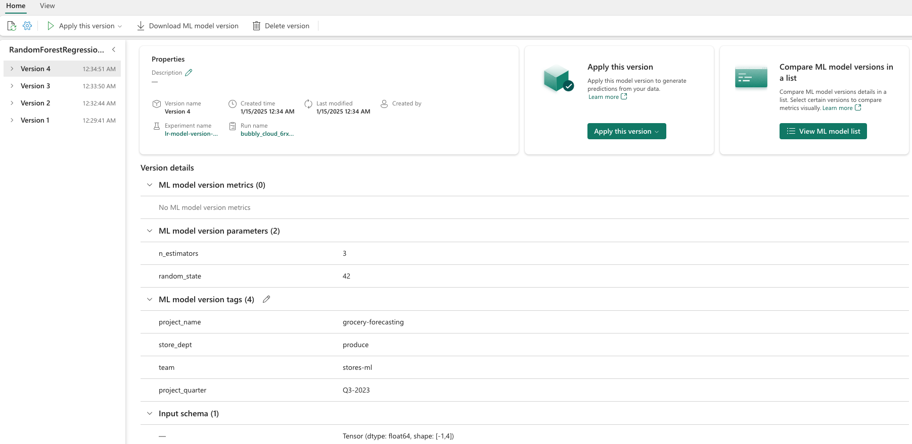
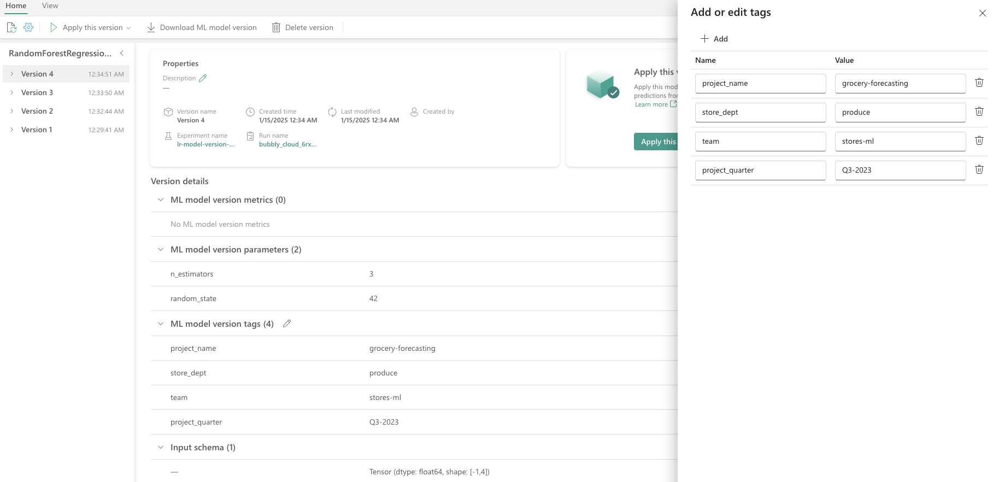
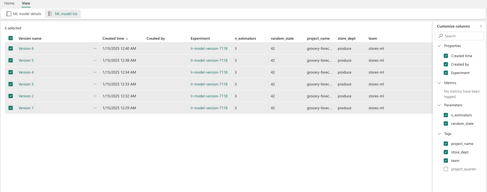

# ML Model

- A machine learning model is a file trained to recognize certain types of patterns.

    - You train a model over a set of data, and you provide it an algorithm that uses to reason over and learn from that data set. 

    - After you train the model, you can use it to reason over data that it never saw before, and make predictions about that data.

- In MLflow, a machine learning model can include multiple model versions. 

    - Here, each version can represent a model iteration.

## Create a Machine Learning Model

- In MLflow, machine learning models include a standard packaging format. 

    - This format allows use of those models in various downstream tools, including batch inferencing on Apache Spark.

    - The format defines a convention to save a model in different "flavours" that different downstream tools can understand.

- You can directly create a machine learning model from the Fabric UI. The MLflow API can also directly create the model.

### Steps

1. Create a new data science workspace, or select an existing data science workspace.

2. Create a new workspace or select an existing one.

3. You can create a new item through the workspace

    1. Select your workspace.

    2. Select **New item**.

    3. Select **ML model** under *Analyze and train data*.

4. After model creation, you can start adding model versions to track run metrics and parameters. Register or save experiment runs to an existing model.

### API

- You can also create a machine learning model directly from your authroing experience with the `mlflow.register_model()` API. If a registered machine learning model with the given name doesn't exist, the API creates it automatically.

```python
import mlflow

model_uri = "runs:/{}/model-uri-name".format(run.info.run_id)
mv = mlflow.register_model(model_uri, "model-name")

print("Name: {}".format(mv.name))
print("Version: {}".format(mv.version))
```

## Manage Versions

- A machine learning model contains a collection of model versions for simplified tracking and comparison. Within a model, a data scientist can navigate across various model versions to explore the underlying parameters and metrics.

- Data scientists can also make comparisons across model versions to identify whether or not newer models might yield better results.

### Track machine learning models

- A machine learning model version represents an individual model that is registered for tracking.

    <figure markdown="span">
    
    <figcaption>ML Model Version Tracking (Microsoft, 2025)</figcaption>
    </figure>

- Each model version includes the following information:

    - *Time created*: Date and time of model creation.

    - *Run Name*: The identifier for the experiment runs used to create this specific model version.

    - *Hyperparameters*: Hyperparameters are saved as key-value pairs. Both keys and values are strings.

    - *Metrics*: Run metrics saved as key-value pairs. The value is numeric.

    - *Model Schema/Signature*: A description of the model inputs and outputs.

    - *Logged files*: Logged files in any format. For example, you can record images, environment, models, and data files.

    - *Tags*: Metadata as key-value pairs to runs.

## Apply Tags to ML Models

- MLflow tagging for model versions enables users to attach custom metadata to specific versions of a registered model in the MLflow Model Registry.

    - These tags, stored as key-value pairs, help organize, track, and differentiate between model versions, making it easier to manage model lifecycles.

    - Tags can be used to denote the model's purpose, deployment environment, or any other relevant information, facilitating more efficient model management and decision-making within teams.

- This code demonstrates how to train a RandomForestRegressor model using Scikit-learn, log the model and parameters with MLflow, and then register the model in the MLflow Model Registry with custom tags.

    ```python
    import mlflow.sklearn
    from mlflow.models import infer_signature
    from sklearn.datasets import make_regression
    from sklearn.ensemble import RandomForestRegressor

    # Generate synthetic regression data
    X, y = make_regression(n_features=4, n_informative=2, random_state=0, shuffle=False)

    # Model parameters
    params = {"n_estimators": 3, "random_state": 42}

    # Model tags for MLflow
    model_tags = {
        "project_name": "grocery-forecasting",
        "store_dept": "produce",
        "team": "stores-ml",
        "project_quarter": "Q3-2023"
    }

    # Log MLflow entities
    with mlflow.start_run() as run:
        # Train the model
        model = RandomForestRegressor(**params).fit(X, y)
        
        # Infer the model signature
        signature = infer_signature(X, model.predict(X))
        
        # Log parameters and the model
        mlflow.log_params(params)
        mlflow.sklearn.log_model(model, artifact_path="sklearn-model", signature=signature)

    # Register the model with tags
    model_uri = f"runs:/{run.info.run_id}/sklearn-model"
    model_version = mlflow.register_model(model_uri, "RandomForestRegressionModel", tags=model_tags)

    # Output model registration details
    print(f"Model Name: {model_version.name}")
    print(f"Model Version: {model_version.version}")
    ```

- After applying the tags, you can view them directly on the model version details page. 

    - Additionally, tags can be added, updated, or removed from this page at any time.

    <figure markdown="span">
    
    <figcaption>ML Model Version Tagging (Microsoft, 2025)</figcaption>
    </figure>


## Compare and Filter ML Models

- To compare and evaluate the quality of machine learning model versions, you can compare the parameters, metrics, and metadata between selected versions.

### Visually Compare ML Models

- You can visually compare runs within an existing model. Visual comparison allows easy navigation between, and sorts across, multiple versions.

    <figure markdown="span">
    
    <figcaption>Compare ML Model Runs (Microsoft, 2025)</figcaption>
    </figure>

- To compare runs, you can:

    1. Select an existing machine learning model that contains multiple versions.

    2. Select the **View** tab, and then navigate to the **Model list** view. You can also select the option to **View model** list directly from the details view.

    3. You can customize the columns within the table. Expand the **Customize** columns pane. From there, you can select the properties, metrics, tags, and hyperparameters that you want to see.

    4. Lastly, you can select multiple versions, to compare their results, in the metrics comparison pane. From this pane, you can customize the charts with changes to the chart title, visualization type, X-axis, Y-axis, and more.

### Compare using MLflow API

```python
from pprint import pprint

client = MlflowClient()
for rm in client.list_registered_models():
    pprint(dict(rm), indent=4)
```

For more information, refer to [MLflow documentation](https://www.mlflow.org/docs/latest/python_api/mlflow.html).

## Apply Machine Learning Model

- Once you train a model on a data set, you can apply that model to data it never saw to generate predictions.

- We call this model use technique scoring or inferencing. For more information about Microsoft Fabric model scoring, see the next section.

<div style="display: flex; justify-content: space-between;" markdown="1">

[:material-arrow-left: Pipelines](./pipelines.md){ .md-button }

[Reports :material-arrow-right:](./reports.md){ .md-button }

</div>