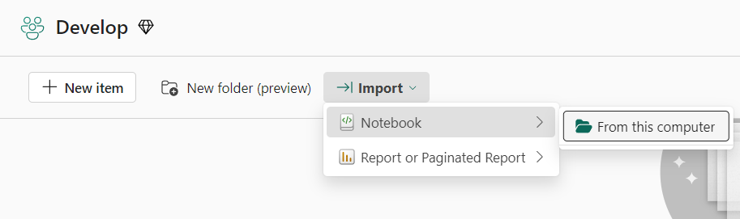

# Notebook

## Creating a Notebook

From the current workspace, click on **New Item** and then **Notebook**, which is the same process as creating anynew Fabric item.

### Importing Existing Notebook

- You can import one or more existing notebooks from your local computer using the entry in the workspace toolbar. 

- Fabric notebooks recognize the standard Jupyter Notebook .ipynb files, and source files like .py, .scala, and .sql, and create new notebook items accordingly.

<figure markdown="span">

<figcaption>Importing a Notebook (Microsoft, 2025)</figcaption>
</figure>

## Saving a Notebook

- A notebook in Fabric will by default save automatically after you open and edit it. 

- You can also use **Save a copy** to clone another copy in the current workspace to another workspace.

- To save a notebook manually, you can switch to the **Manual** save option to have a local branch of your notebook item, and then use **Save** or **Ctrl+S** to save your changes.

    - To change to manual saving, you can also go to **Edit** -> **Save options** -> **Manual**.

[:material-arrow-left: SQL Analytics Endpoint](./sql_endpoint.md){ .md-button }

[Semantic Model :material-arrow-right:](./semantic_model.md){ .md-button }

