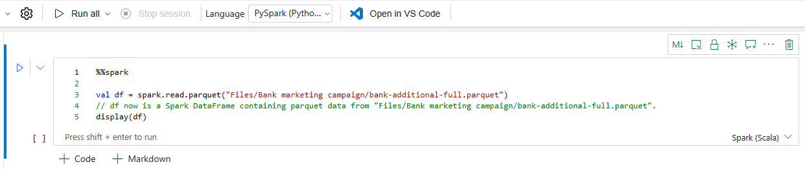
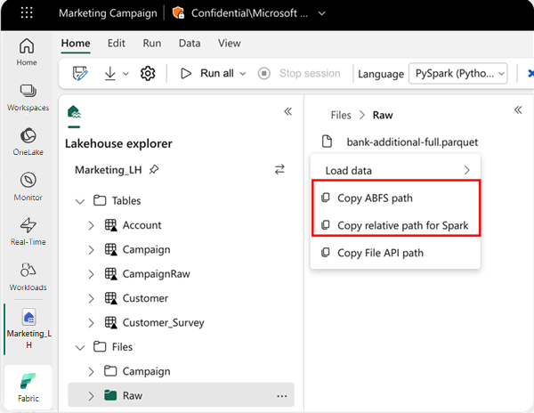
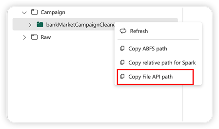
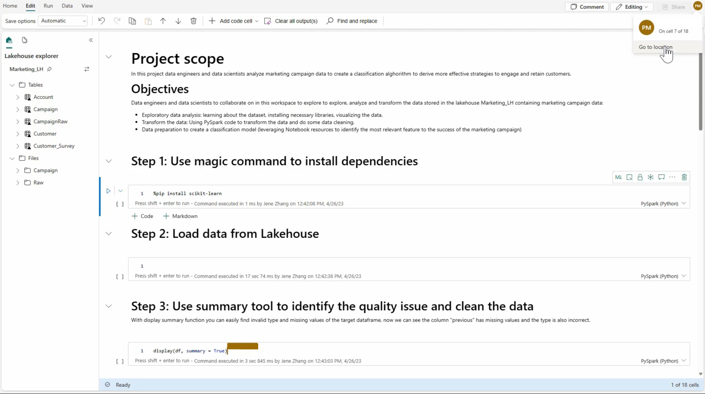

# Notebook

## Creating a Notebook

From the current workspace, click on **New Item** and then **Notebook**, which is the same process as creating any new Fabric item.

### Importing Existing Notebook

- You can import one or more existing notebooks from your local computer using the entry in the workspace toolbar. 

- Fabric notebooks recognize the standard Jupyter Notebook .ipynb files, and source files like .py, .scala, and .sql, and create new notebook items accordingly.

<figure markdown="span">

<figcaption>Importing a Notebook (Microsoft, 2025)</figcaption>
</figure>

## Languages

- Fabric notebooks currently support four Apache Spark languages:

    - PySpark (Python)

    - Spark (Scala)

    - Spark SQL

    - SparkR

### Using Multiple Languages

<figure markdown="span">

<figcaption>Using Different Language (Microsoft, 2025)</figcaption>
</figure>

- You can use multiple languages in a notebook by specifying the language magic command at the beginning of a cell. You can also switch the cell language from the language picker. The following table lists the magic commands for switching cell languages.

| Magic Command | Language  | Description                                      |
|---------------|-----------|--------------------------------------------------|
| `%%pyspark`   | Python    | Execute a Python query against Apache Spark Context. |
| `%%spark`     | Scala     | Execute a Scala query against Apache Spark Context. |
| `%%sql`       | SparkSQL  | Execute a SparkSQL query against Apache Spark Context. |
| `%%html`      | HTML      | Execute an HTML query against Apache Spark Context. |
| `%%sparkr`    | R         | Execute an R query against Apache Spark Context. |

## Connecting Lakehouses and Notebooks

- You can navigate to different lakehouse in the Lakehouse explorer and set one lakehouse as the default by pinning it.

    - Your default is then mounted to the runtime working directly, and you can read or write to the default lakehouse using a local house/

    - You must restart the session after pinning a lakehouse or renaming the default lakehouse.

### Add or Remove a Lakehouse

- Selecting the **X** icon beside a lakehouse name removes it from the notebook tab, but the lakehouse item still exists in the workplace.

- Select **Add lakehouse** to add more lakehouses to the notebook, either by adding an existing one or creating a new lakehouse.

### Explore a Lakehouse File

- The subfolder and files under the Tables and Files section of the Lake view appear in a content area between the lakehouse list and the notebook content. Select different folders in the Tables and Files section to refresh the content area.

### Loading Data into Lakehouse

- In the code cell of the notebook, use the following code example to read data from the source and load it into **Files**, **Tables**, or both sections of your lakehouse.

- To specify the location to read from, you can use the relative path if the data is from the default lakehouse of your current notebook. Or, if the data is from a different lakehouse, you can use the absolute Azure Blob File System (ABFS) path. Copy this path from the context menu of the data.

### Loading with Apache Spark API

<figure markdown="span">

<figcaption>Copy Path Menu (Microsoft, 2025)</figcaption>
</figure>

- **Copy ABFS path**: This option returns the absolute path of the file.

- **Copy relative path for Spark**: This option returns the relative path of the file in your default lakehouse.

    ```python
    df = spark.read.parquet("location to read from") 

    # Keep it if you want to save dataframe as CSV files to Files section of the default lakehouse

    df.write.mode("overwrite").format("csv").save("Files/ " + csv_table_name)

    # Keep it if you want to save dataframe as Parquet files to Files section of the default lakehouse

    df.write.mode("overwrite").format("parquet").save("Files/" + parquet_table_name)

    # Keep it if you want to save dataframe as a delta lake, parquet table to Tables section of the default lakehouse

    df.write.mode("overwrite").format("delta").saveAsTable(delta_table_name)

    # Keep it if you want to save the dataframe as a delta lake, appending the data to an existing table

    df.write.mode("append").format("delta").saveAsTable(delta_table_name)
    ```

### Loading with Pandas API

- To support Pandas API, the default lakehouse is automatically mounted to the notebook. The mount point is '/lakehouse/default/'. You can use this mount point to read/write data from/to the default lakehouse. The "Copy File API Path" option from the context menu returns the File API path from that mount point. The path returned from the option Copy ABFS path also works for Pandas API.

- **Spark API**: Copy ABFS path or Copy relative path for Spark. 

- **Pandas API**: Copy ABFS Path or Copy Fil API path.

<figure markdown="span">

<figcaption>Copy File API Path (Microsoft, 2025)</figcaption>
</figure>

- **Copy File API Path**: This option returns the path under the mount point of the default lakehouse.

    ```python
    # Keep it if you want to read parquet file with Pandas from the default lakehouse mount point 

    import pandas as pd
    df = pd.read_parquet("/lakehouse/default/Files/sample.parquet")

    # Keep it if you want to read parquet file with Pandas from the absolute abfss path 

    import pandas as pd
    df = pd.read_parquet("abfss://DevExpBuildDemo@msit-onelake.dfs.fabric.microsoft.com/Marketing_LH.Lakehouse/Files/sample.parquet")
    ```

## Collaborate in a Notebook

<figure markdown="span">

<figcaption>Collaborating in a Notebook (Microsoft, 2025)</figcaption>
</figure>

- The Fabric notebook is a collaborative item that supports multiple users editing the same notebook.

- When you open a notebook, you enter the coediting mode by default, and every notebook edit is automatically saved. If your colleagues open the same notebook at the same time, you see their profile, run output, cursor indicator, selection indicator, and editing trace. By using the collaboration features, you can easily accomplish pair programming, remote debugging, and tutoring scenarios.

## Saving a Notebook

- A notebook in Fabric will by default save automatically after you open and edit it. 

- You can also use **Save a copy** to clone another copy in the current workspace to another workspace.

- To save a notebook manually, you can switch to the **Manual** save option to have a local branch of your notebook item, and then use **Save** or **Ctrl+S** to save your changes.

    - To change to manual saving, you can also go to **Edit** -> **Save options** -> **Manual**.

## Export a Notebook

- You can export your notebook to other standard formats. Synapse notebook can be exported into:

    - The standard notebook file (.ipynb) that is used for Jupyter notebooks/

    - An HTML file (.html) that can be opened from a browser directly.

    - A Python file (.py).

    - A Latex file (.tex).

<div style="display: flex; justify-content: space-between;" markdown="1">

[:material-arrow-left: SQL Analytics Endpoint](./sql_endpoint.md){ .md-button }

[Semantic Model :material-arrow-right:](./semantic_model.md){ .md-button }

</div>