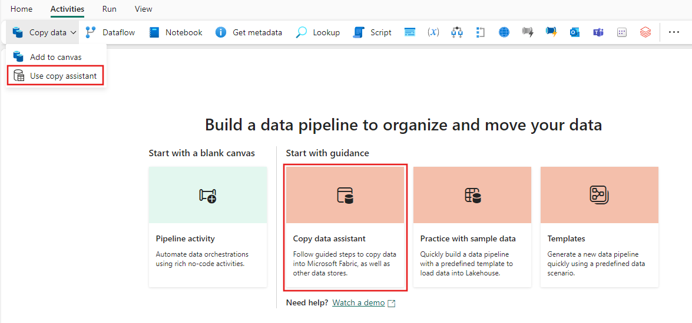
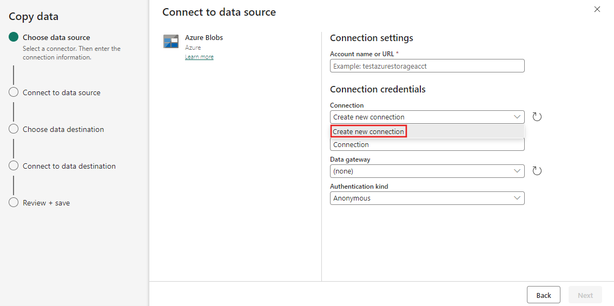
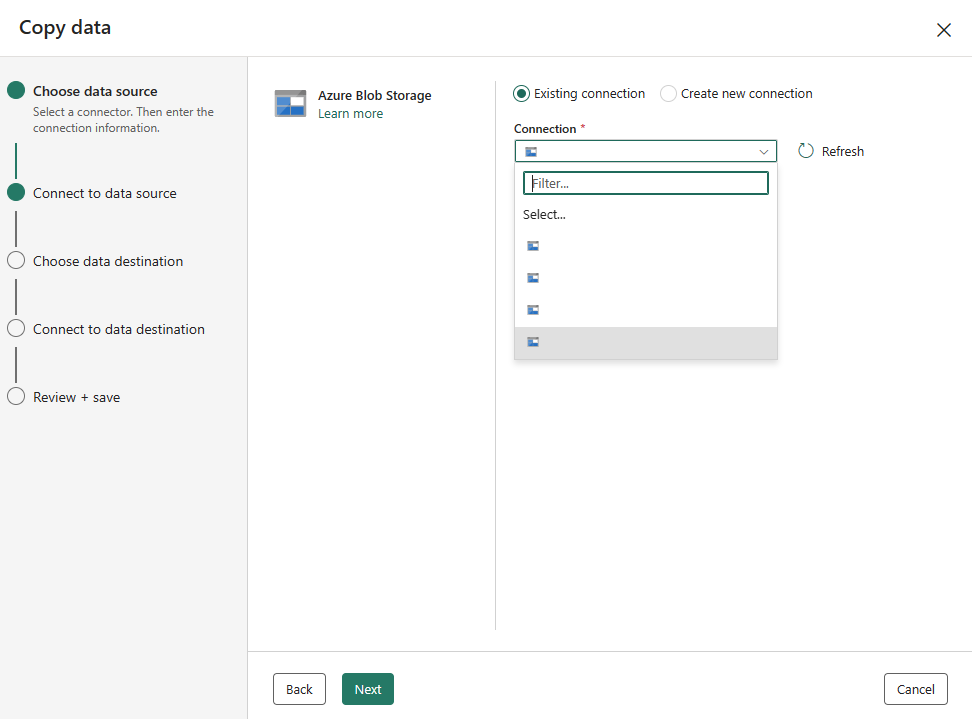
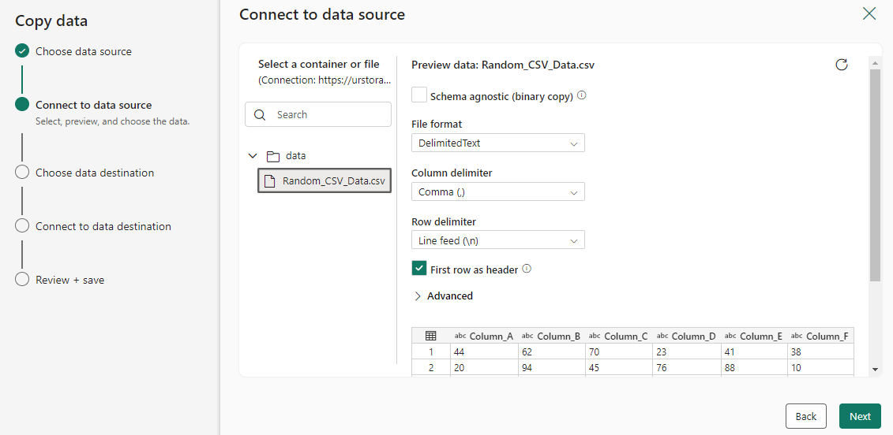
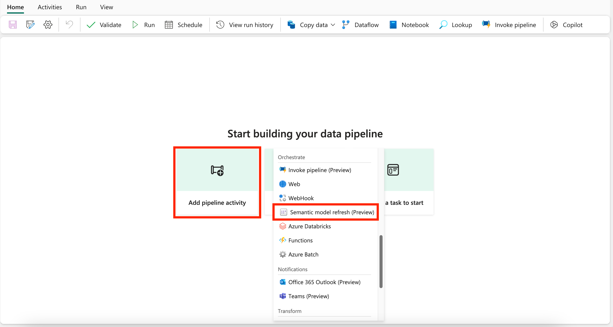
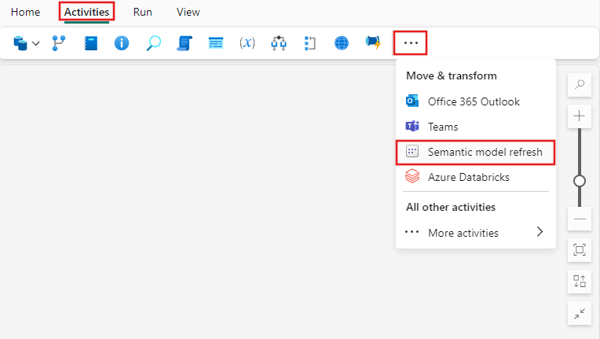
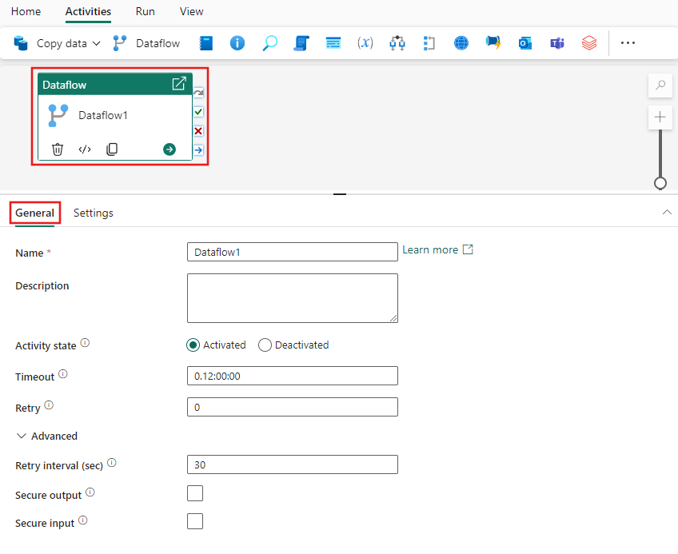
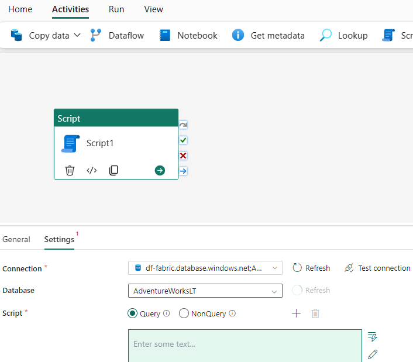
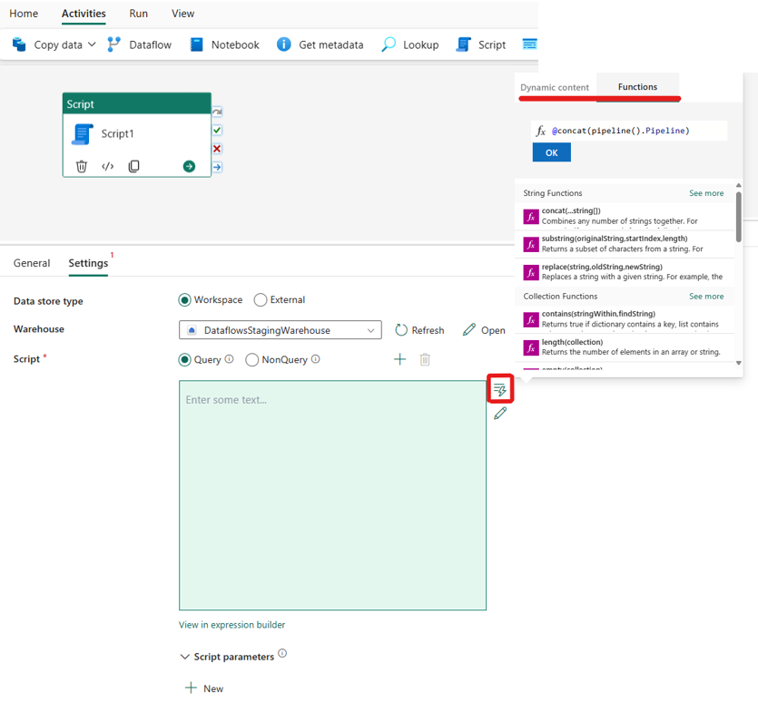
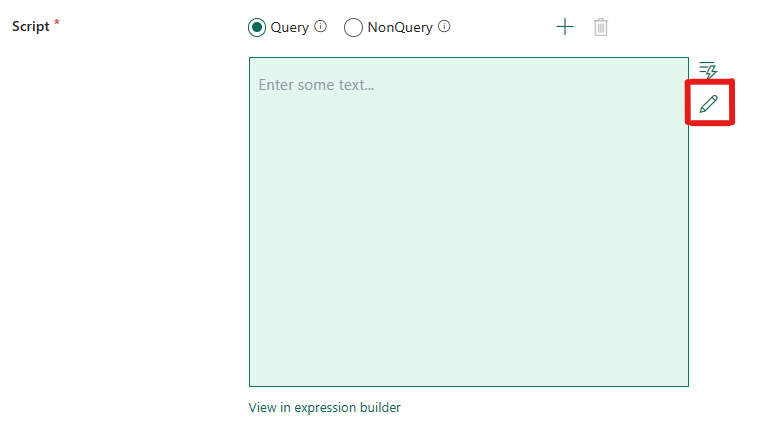

# Pipelines

- A data pipeline is a logical grouping of activities that together perform a data ingestion task.

- Pipelines allow you to manage extract, transform, and load (ETL) activities instead of managing each one individually.

## Create a Data Pipeline

1. To create a new pipeline navigate to your workspace, select the **+ New Item**. Under **Get Data**, select **Data pipeline**.

2. In the **New pipeline** dialog, provide a name for your new pipeline and select **Create**. 

3. You'll land in the pipeline canvas area, where you see options to get started.

    - From here, you can choose what activity you want to do in the pipeline.

## Adding Activties to a Pipeline

*Only some of the Activities are listed here, refer to [Activity Overview](https://learn.microsoft.com/en-us/fabric/data-factory/activity-overview) for a more comprehensive list.*

1. Create a new pipeline in your workspace.

2. On the Activities tab for the pipeline, browse the activities displayed, scrolling to the right if necessary to see all activties. Select an activity to add it to the pipeline editor.

3. When you add an activity and select it in the pipeline editor canvas, its General setting will appear in the properties pane below the canvas. 

4. Each activity also contains custom properties specific to its conifuration on other tabs in the properties pane.

### General Settings

- When you add a new activity to a pipeline and select it, you'll see its properties panes in the area at the bottom of the screen. These properties panes include General, Settings, and sometimes other panes as well.

## Copy Activity (Copy Data Assistant)

1. Open an existing pipeline or create a new data pipeline.

2. Select **Copy data** on the canvas to open the **Copy Assistant** tool to get started. Alternatively, select **Use copy assistant** from the **Copy data** drop down list under the **Activties** tab on the ribbon.

    <figure markdown="span">
    
    <figcaption>Use Copy Assistant (Microsoft, 2024)</figcaption>
    </figure>

### Configure Your Source

1. Select a data source type from the category.

2. Create a connection to your data source by selecting **Create new connection**.

    <figure markdown="span">
    
    <figcaption>Create new connection (Microsoft, 2024)</figcaption>
    </figure>

    - After you select **Create new connection**, fill in the required connection information and then select **Next**. For the details of connection creation for each type f data source, you can refer to [Microsoft: connectors](https://learn.microsoft.com/en-us/fabric/data-factory/connector-overview).

    - If you have existing connections, you can select Existing connection and select your connection from the drop-down list.

        <figure markdown="span">
        
        <figcaption>Existing connection (Microsoft, 2024)</figcaption>
        </figure>

3. Choose the file or folder to be copied in this source configuration step, and then select **Next**.

    <figure markdown="span">
    
    <figcaption>Choose copy file or folder (Microsoft, 2024)</figcaption>
    </figure>

### Configure Your Destination

1. Select a data source type from the category. You can either create a new connection or use an existing one (same as before). The capabilities of **Test connection** and **Edit** are available to each selected connection.

2. Configure and map your source data to your destination. Then select **Next** to finish your destination configurations.

### Review and Create Your Copy Activity

1. Review your copy activity settings in the previous steps and select **OK** to finish. Or you can go back to the previous steps to edit your settings if needed in the tool.

## Semantic Model Refresh Activity

### Create the activity

1. Create a new pipeline in your workspace.

2. Before you the Semantic model refresh activity, you need a connection to your Power BI datasets.

3. Search for Semantic model refresh from the home screen card and select it, or select the activity from the **Activities** bar and add it to the pipeline canvas.

    <figure markdown="span">
    
    <figcaption>Home Screen Card (Microsoft, 2024)</figcaption>
    </figure>

    <figure markdown="span">
    
    <figcaption>Activities Bar (Microsoft, 2024)</figcaption>
    </figure>

4. Select the new Semantic model refresh activity on the pipeline editor canvas if it isn't already selected.

### Choose tables and partitions to refresh

- You can optimize your semantic model refresh by choosing just the tables that you wish to refresh as opposed to a full model refresh. 

    - You will find the setting to choose optional table and partition refresh under settings.

    - Each of these properties supports parameterization using the pipeline expression builder.

### Save and run or schedule the pipeline

- Although the Semantic model refresh activity is typically used with other activities, it can be run directly as is. 

- After you configure any other activities required for your pipeline, switch to the **Home** tab at the top of the pipeline editor, and select the save button to save your pipeline. 

    - Select **Run** to run it directly, or **Schedule** to schedule it.

    - You can also view the run history here or configure other settings.

## Dataflow Activity

### Creating the Activity

1. Search for Dataflow in the pipeline **Activities** pane, and select it to add it to the pipeline canvas.

2. Select the new Dataflow activity on the canvas if it isn't already selected.

    <figure markdown="span">
    
    <figcaption>Dataflow Settings (Microsoft, 2024)</figcaption>
    </figure>

### Dataflow activity settings

- Select the **Settings** tab, then select an existing workspace and dataflow to run.

- Inside the Dataflow parameters section you are able to enter the name of the parameter that you wish to pass as well as the type and value that you wish to pass.

## Invoke Pipeline Activity

### Create the activity

1. Search for **invoke pipeline** in the pipeline **Activities** pane, and select it to add it to the pipeline canvas.

2. Select the new **Invoke pipeline activity** on the canvas if it isn't already selected.

### Invoke pipeline settings

- Select the **Settings** tab, and choose an existing pipeline from the **invoke pipeline** dropdown, or use the **+ New** button to create a new pipeline directly.

    - You can choose to wait on completion, or continue directly, in which case the invoked pipeline executes in parallel with activities following it within the parent pipeline's execution flow. 

- *Connection*: Each **Invoke pipeline activity** requires a Connection object that is stored in the secure Fabric credentials store. This connection object stores your user token associated with your fabric workspace. If you haven't yet created a new **Invoke pipeline activity**, you are required to create a new connection object first before you can use the activity.

- *Workspace*: Choose the Fabric workspace where the target pipeline is located that you wish to innvoke from your parent pipeline.

## Notebook Activity

### Creating the activity

1. Search for Notebook in the pipeline **Activities** pane, and select it to add it to the pipeline canvas.

2. Select the new Notebook activity on the canvas if it isn't already selected.

### Notebook settings

- Select the **Settings** tab, select an existing notebook from the **Notebook** dropdown, and optionallt specify any parameters to pass to the notebook.

#### Session tag

- In order to minimize the amount of time it takes to execute your notebook job, you could optionally set a session tag. Setting the session tag will instruct Spark to reuse any existing Spark session thereby minimizing the startup time. 

- Any arbitrary string value can be used for the session tag. If no session exists a new one would be created using the tag value.

## Script Activity

1. Select on add a pipeline activity and search for **Script**.

2. Alternately, you can search for **Script** Activity in the pipeline Activities ribbon at the top, and select it to add it to the pipeline canvas,=.

3. Select the new Script activity on the canvas if it isn't already selected.

### Configure the script activity

1. Select the **Settings** tab, and choose an existing connection from the dropdown, or create a new one.

2. After selecting your connection, you can choose either **Query** to get a data result or **NonQuery** for any catalog operations.

    <figure markdown="span">
    
    <figcaption>Query or NonQuery (Microsoft, 2024)</figcaption>
    </figure>

3. You can input content into the script expression box. We have multiple ways in which you can input script content into the expression box.

    - You can add dynamic content by either clicking in the box or clicking on the "dynamic content" icon on the right-hand size. A flyout that showcases dynamic content and functions that you can seamlessly use to build your expressions appears.

    <figure markdown="span">
    
    <figcaption>Script Activity Flyout (Microsoft, 2024)</figcaption>
    </figure>

    - You can also directly edit your script code in the code editor by selecting the pencil icon on the irght-hand size, as seen in the following screenshot. After you select it, a new dialog box will pop up so that you can seamlessly write and edit your code.

    <figure markdown="span">
    
    <figcaption>Script Activity Edit Code (Microsoft, 2024)</figcaption>
    </figure>

[:material-arrow-left: Dataflow](./dataflow.md){ .md-button }

[ML Model :material-arrow-right:](./ml_model.md){ .md-button }

