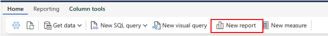
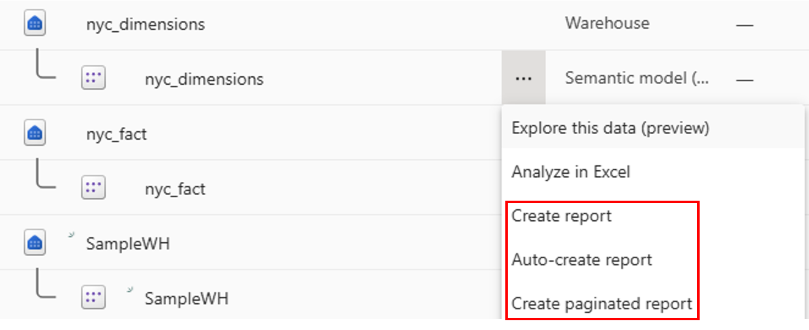
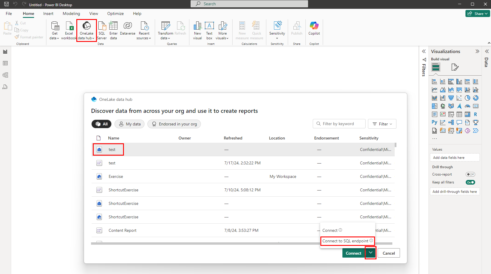

# Reports

## Create Report in Power BI Service

1. In the data storage that you want to create a report from, using the ribbon and the main home tab, navigate to the **New report** button. This option provides a native, quick way to create report built on top of the default Power BI semantic model.

    <figure markdown="span">
    
    <figcaption>Home Ribbon (Microsoft, 2025)</figcaption>
    </figure>

2. If no tables have been added to the default Power BI semantic model, the dialog first automatically adds tables, prompting the user to confirm or manually select the tables included in the canonical default semantic model fist, ensuring there's always data first.

3. With a default semantic model that has tables, the New report opens a browser tab to the report editing canvas to a new report that is built on the semantic model. When you save your new report you're prompted to choose a workspace, provided you have write permissions for that workspace.

## Use Default Power BI Semantic Model Within Workspace

1. Using the default semantic model and action menu in the workspace: In the Microsoft Fabric workspace, navigate to the default Power BI semantic model and select the More menu (...) to create a report in the Power BI service.

    <figure markdown="span">
    
    <figcaption>Create Report (Microsoft, 2025)</figcaption>
    </figure>

2. Select **Create report** to open the report editing canvas to a new report on the semantic model. When you save your new report, it's saved in the workspace that contains the semantic model as long as you have write permissions on that workspace.

## Create Reports in the Power BI Desktop

1. Use **Data hub** menu in the ribbon to get list of all items.

2. Select the warehouse that you would like to connect.

3. On the **Connect** button, select the dropdown list, and select **Connect to SQL endpoint**.

    <figure markdown="span">
    
    <figcaption>Data Hub Power BI Desktop (Microsoft, 2025)</figcaption>
    </figure>

[:material-arrow-left: ML Model](./ml_model.md){ .md-button }

