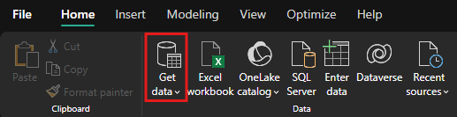
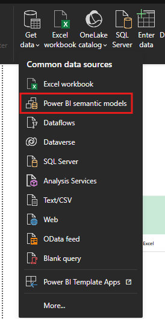
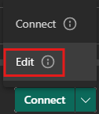

# Semantic Model

- Power BI semantic models are a logical description of an analytical domain, with metrics, business friendly terminology, and repreentation, to enable deeper analysis.

- Typically a [star schema](../architecture/star_schema.md) with facts that represent a domain, and dimensions that allow you to analyze, or slice and dice the domain to drill down, filter, and calculate different analyses.

- With the semantic model, the semantic model is created for you automatically, and you choose which tables, relationships, and measures are to be added, and the aforementioned business logic gets inherited from the parent [lakehouse](./lakehouse.md) or [warehouse](./warehouse.md) respectively, jump-starting the downstream analytics experience for business intelligence and analysis with an item in Microsoft Fabric that is managed, optimized, and kept in sync with no user intervention.

## Direct Lake Mode

- The technology is based on the idea of consuming parquet-formatted files directly from a [data lake](../general_terminology/data_engineering.md#data-lake), without having a query a Warehouse or [SQL analytics endpoint](./sql_endpoint.md), and without having to import or duplicate data into a Power BI semantic model.

- Direct Lake mode is the storage mode for default Power BI semantic models, and new Power BI semantic models created in a warehouse or SQL analytics endpoint.

- Calculated columns are not supported in Direct Lake semantic model.

### DirectQuery vs. Import vs. Direct Lake

- **DirectQuery Mode**: the Power BI engine directly queries the data from the source for each query execution, and the query performance depends on the data retrieval speed. 

    - DirectQuery eliminates the need to copy data, ensuring that any changes in the source are immediately reflected in query results.

- **Import Mode**: the Power BI engine must first copy the data into the memory, at data refresh time. Any changes to the underlying data source are picked up during the next data refresh.

    - The performance is better because the data is readily available in memory, without having to query the data from the source for each query execution.

- **Direct Lake Mode**: eliminates the Import requirement to copy the data by consuming the data files directly into memory. Because there is no explicit import process, it's possible to pick up any changes at the source as they occur. 

    - Ideal choice for analyzing very arge datasets and datasets with frequent updates at the source. 

     - Direct Lake will automatically fallback to Direct Query using the SQL analytics endpoint of the Warehouse or SQL analytics endpoint when Direct Lake exceeds limits for the SKU, or uses features not supported, allowing report users to continue uninterrupted.

#### Decision-making

| Feature / Consideration      | Import Mode                            | DirectQuery Mode                         | Direct Lake Mode                          |
|-----------------------------|----------------------------------------|------------------------------------------|-------------------------------------------|
| **Performance**             | Fastest – data is cached               | Slower – queries data live               | Fast – queries Delta Lake directly        |
| **Data Freshness**          | Stale – depends on refresh schedule    | Real-time or near real-time              | Near real-time with no refresh needed     |
| **Storage Location**        | Power BI dataset                       | External source (SQL, Fabric Warehouse)  | Fabric Lakehouse (Delta Lake)             |
| **Data Volume**             | Limited by model size (1GB – 10GB+)    | Handles large data volumes               | Handles large data volumes                |
| **Transformations**         | Full Power Query support               | Limited transformation support           | No Power Query – relies on pre-modeled data|
| **Modeling Flexibility**    | Full DAX and relationships support     | Limited (e.g., no many-to-many joins)    | Full DAX and relationships support        |
| **Offline Availability**    | Fully available offline                | Requires live connection                 | Requires Fabric environment connectivity  |
| **Use Cases**               | Dashboards with static/historical data | Live dashboards, operational reporting   | Lakehouse analytics, semi-real-time views |
| **Best For**                | Frequent analysis of curated data      | Monitoring KPIs with up-to-date data     | High-volume data with fast access needed  |
| **Refresh Required**        | Yes – scheduled or manual              | No – always live                         | No – data reflects lake content directly  |
| **Security Management**     | Row-level security in Power BI         | Security managed at source               | Security via Lakehouse and semantic model |

- Use cases:

    - **Import Mode**: Best for curated datasets, fast performance, and dashboards that don’t require constant updates.

    - **DirectQuery**: Best when real-time or frequently changing data is essential, and the data source supports high concurrency.

    - **Direct Lake**: Ideal for large-scale, cloud-native analytics with minimal latency from lakehouse storage.

## Default Power BI Semantic Model

- When you create a warehouse or SQL analytics endpoint, a default Power BI semantic model is created. The default semantic model is represented with the *(default)* suffix.

    - You can use **Manage default semantic model** to choose tables to add.

### Access the default Power BI semantic model

- Go to your workspace, and find the semantic model that matches the name of the semantic model that matches the name of the desired lakehouse. The default Power BI semantic model follows the naming convention of the lakehouse.

<figure markdown="span">

<figcaption>Finding Default Semantic Model (Microsoft, 2025)</figcaption>
</figure>

## Creating a new Power BI semantic model in Direct Lake storage mode

- You can create additional Power BI semantic models in Direct Lake mode using SQL analytics endpoint or Warehouse data.

- These new Power BI semantic models can be edited using Open data model and can be used with other features such as write DAX queries and semantic model row-level security.

- The **New Power BI semantic model** button creates a new blank semantic model separate from the default semantic model.

### Steps to create semantic model in Direct Lake mode

1. Open the lakehouse and select **New Powe BI semantic model** from the ribbon.

2. Alternatively, open a Warehouse or Lakehouse's SQL analytics endpoint, first select the **Reporting**** ribbon, then select New **Power BI semantic model**.

3. Enter a name for the new semantic model, select a workspace to save it in, and pick the tables to include. Then select **Confirm**.

4. The new Power BI semantic model can be edited in the workspace, where you can add relationships, measures, rename tables and columns, choose how values are displayed in report visuals, and much more. If the model view does not show after creation, check the pop-up blocker of your browser.

5. To edit the Power BI semantic model later, select **Open data model** from the semantic model context menu or item details page to edit the semantic model further.

## Creating a New Power BI Semantic Model in Import or DirectQuery Storage Mode

1. Open Power BI Desktop, sign in, and select **OneLake**.

2. Choose the SQL analytics endpoint of the lakehouse or warehouse.

3. Select the connect button dropdown list and choose **Connect to SQL endpoint**.

4. Select import or DirectQuery storage mode and the tables to add to the semantic model.

To create relationships in data model, refer to [Architecture: Data Model Relationships](../architecture/relationships.md).

## Connecting to Semantic Model in Power BI Desktop

1. Open Power BI Desktop

2. Open the report that you wish to connect the semantic model to (alternatively, create a blank report).

3. On the **Home** tab, click on **Get Data**.

    <figure markdown="span">
    
    </figure>

4. In the dropdown, click **Power BI semantic models**.

    <figure markdown="span">
    
    </figure>

5. Click on the semantic model that you wish to connect to. The **Connect** button should turn green, and there should also be a button to click for a dropdown on the button.

    - If there is no dropdown, you can simply click on **Connect**, and skip the next step.

6. Click on **Edit** in the dropdown.

    <figure markdown="span">
    
    </figure>

[:material-arrow-left: Notebook](./notebook.md){ .md-button }

[Warehouse :material-arrow-right:](./warehouse.md){ .md-button }

