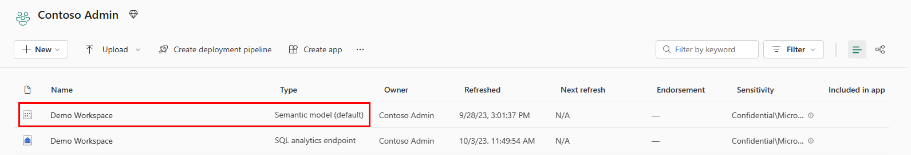

# Semantic Model

- Power BI semantic models are a logical descriptionof an analytical domain, with metrics, business friendly terminology, and repreentation, to enable deeper analysis.

- Typically a [star schema](../architecture/star_schema.md) with facts that represent a domain, and dimensions that allow you to analyze, or slice and dice the domain to drill down, filter, and calculate different analyses.

- With the semantic model, the semantic model is created for you automatically, and you choose which tables, relationships, and measures are to be added, and the aforementioned business logic gets inherited from the parent [lakehouse](./lakehouse.md) or [warehouse](./warehouse.md) respectively, jump-starting the downstream analytics experience for business intelligence and analysis with an item in Microsoft Fabric that is managed, optimized, and kept in sync with no user intervention.

## Direct Lake Mode

- The technology is based on the idea of consuming parquet-formatted files directly from a data lake, without having a query a Warehouse or [SQL analytics endpoint](./sql_endpoint.md), and without having to import or duplicate data into a Power BI semantic model.

- Direct Lake mode is the storage mode for default Power BI semantic models, and new Power BI semantic models created in a warehouse or SQL analytics endpoint.

- Calculated columns are not supported in Direct Lake semantic model.

### DirectQuery vs. Import vs. Direct Lake

- **DirectQuery Mode**: the Power BI engine directly queries the data from the source for each query execution, and the query performance depends on the data retrieval speed. 

    - DirectQuery eliminates the need to copy data, ensuring that any changes in the source are immediately reflected in query results.

- **Import Mode**: the Power BI engine must first copy the data into the memory, at data refresh time. Any changes to the underlying data source are picked up during the next data refresh.

    - The performance is better because the data is readily available in memory, without having to query the data from the source for each query execution.

- **DirectLake Mode**: eliminates the Import requirement to copy the data by consuming the data files directly into memory. Because there is no explicit import process, it's possible to pick up any changes at the source as they occur. 

    - Ideal choice for analyzing very arge datasets and datasets with frequent updates at the source. 

     - Direct Lake will automatically fallback to Direct Query using the SQL analytics endpoint of the Warehouse or SQL analytics endpoint when Direct Lake exceeds limits for the SKU, or uses features not supported, allowing report users to continue uninterrupted.

## Default Power BI Semantic Model

- When you create a warehouse or SQL analytics endpoint, a default Power BI semantic model is created. The default semantic model is represented with the *(default)* suffix.

    - You can use **Manage default semantic model** to choose tables to add.

### Access the default Power BI semantic model

- Go to your workspace, and find the semantic model that matches the name of the semantic model that matches the name of the desired lakehouse. The default Power BI semantic model follows the naming convention of the lakehouse.

<figure markdown="span">

<figcaption>Finding Default Semantic Model (Microsoft, 2025)</figcaption>
</figure>