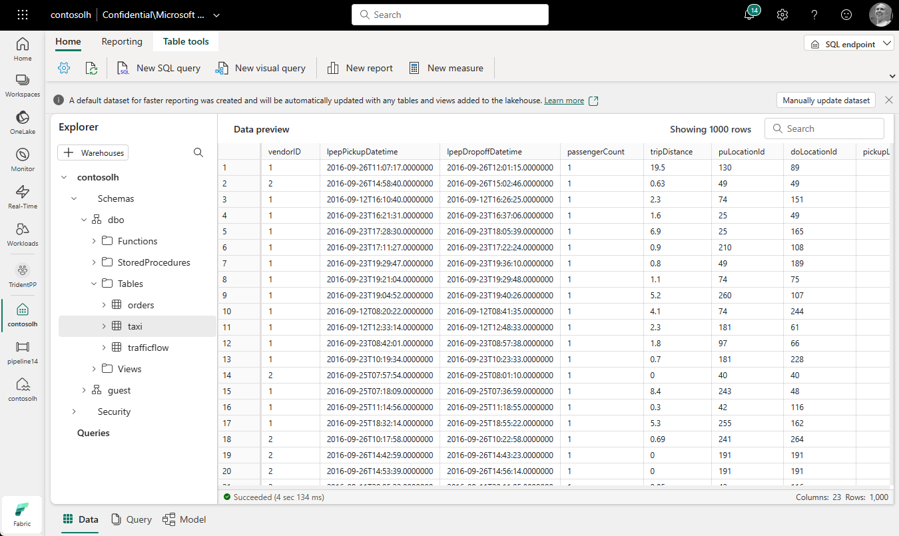

# SQL Analytics Endpoint

- In a SQL analytics endpoint, you can analyze data in Delta tables using T-SQL language, save functions, generate views, and apply SQL security.

<figure markdown="span">

<figcaption>SQL Analytics Endpoint Page (Microsoft, 2025)</figcaption>
</figure>

- Creating a lakehouse creates a SQL Analytics endpoint, which points to the lakehouse Delta table storage. Once you create a Delta table in the lakehouse, it's available for querying using the SQL Analytics endpoint.

    - Warehouse and SQL database also creates a SQL Analytics endpoint when created.

- SQL analytics endpoint operates in read-only mode over lakehouse Delta tables.

    - You can only read data from Delta tables using the SQL analytics endpoint.

    - However, you also have the flexibility to create functions, define views, and implement SQL object-level security to manage access and structure data effectively.

- External Delta tables created with Spark code won't be visible to the SQL analytics endpoint.

    - To solve this, use shortcuts in Table space to make external Delta table svisible to the SQL analytics endpoint.

[:material-arrow-left: Lakehouse](./lakehouse.md){ .md-button }

[Notebook :material-arrow-right:](./notebook.md){ .md-button }

