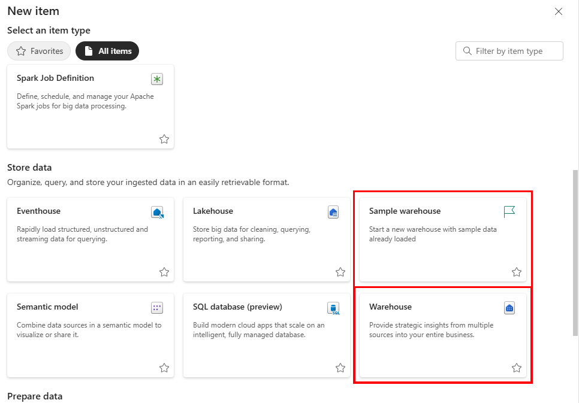
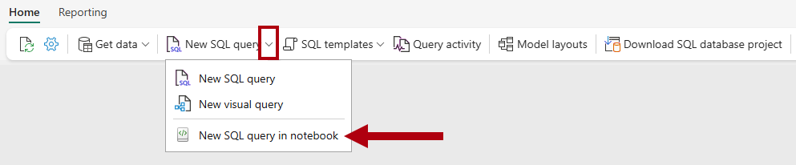
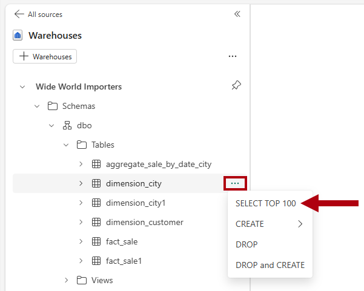
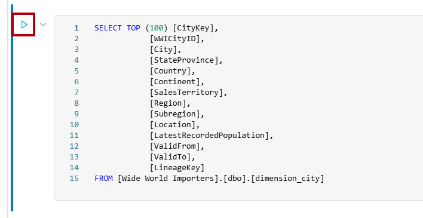
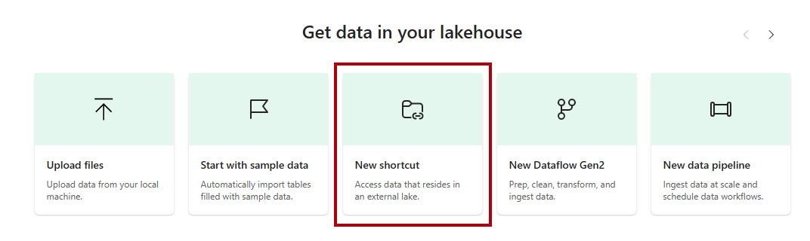
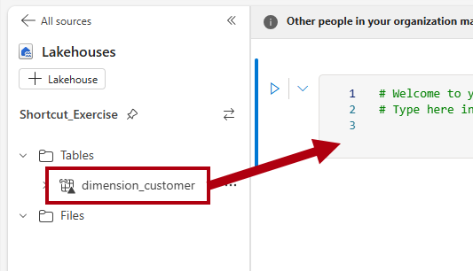

# Warehouse

## Creating a Warehouse

*To decide between the different data storage options, refer to [Warehouse, SQL Database, or Lakehouse?](../terminology/store_data.md#warehouse-sql-database-or-lakehouse)*

- You can start creating your warehouse from the workspace. Select **+ New Item** and look for the **Warehouse card** under the **Store Data** section.

- An empty warehouse is created for you to start creating objects in the warehouse.

<figure markdown="span">

<figcaption>Warehouse Cards (Microsoft, 2025)</figcaption>
</figure>

- Another option available to create your warehouse is through the **Create** button in the navigation pane. Look for the **Warehouse** under **Data Warehouse**.

## Data Ingestion Options

- **COPY (Transact-SQL)**: the COPY statement offers flexible, high-throughput dadta ingestion from an external Azure storage account. You can use the COPY statement as part of your existing ELT/ETL logic in Transact-SQL code.

- **Data pipelines**: pipelines offer a code-free or low-code experience for data ingestion. Using pipelines, you can orchestrate robust workflows for a full Extract, Transform, Load (ETL) experience that includes activities to help prepare the destination environment, run custom Transact-SQL statements, perform lookups, or copy data from a source to a destination.

- **Dataflows**: an alternative to pipelines, dataflows enable easy data preparation, cleaning, and transformation using a code-free experience. 

    - Since the majority of our files are currently stored in Sharepoint folders, this is the default method to bring in our files.

- **Cross-warehouse ingestion**: data ingestion from workspace sources is also possible. This scenario might be required when there's the need to create a new table with a subset of a different table, or as a result of joining different tables in the warehouse and in the lakehouse. For cross-warehouse ingetsion, in addition to the options mentioned, Transact-SQL features such as **INSERT...SELECT**, **SELECT INTO**, or **CREATE TABLE AS SELECT (CTAS)** work cross-warehouse within the same workspace.

### Deciding on Data Ingestion Tool

- **COPY (Transact-SQL)**: for code-rich data ingetsion operations, for the highest data ingestion throughput possible, or when you need to add data ingestion as part of a T-SQL logic. For syntax, see [COPY INTO(T-SQL)](https://learn.microsoft.com/en-us/sql/t-sql/statements/copy-into-transact-sql?view=fabric&preserve-view=true).

- **Data pipelines**: for code-free or low-code, robust data ingestion workflows that run repeatedly, at a schedule, or that involces large volumes of data. For more information, see [Data Pipelines](./pipelines.md).

- **Dataflows**: for a code-free experience that sllows custom transformations to source data before it's ingested. These transformations include (but aren't limited to) changing data types, adding or removing columns, or using functions to produce calculated columns. For more information, see [Dataflow](./dataflow.md).

- **Cross-warehouse ingestion**: for code-rich experiences to create new tables with source data within the same workspace.

## Analyzing Data in Warehouse

### Notebook

#### T-SQL Notebook

1. Open the workspace with your warehouse that you want to analyze, and open the warehouse.

2. On the **Home** ribbon, open the **New SQL query** dropdown listm and then select New SQL query in notebook.

    <figure markdown="span">
    
    <figcaption>New SQL Query in Notebook (Microsoft, 2025)</figcaption>
    </figure>

3. In the **Explorer** pane, select **Warehouses** to reveal the objects of the warehouse.

4. To generate a SQL template to explore data, to the right of the table that you want to analyze, select the ellipse (...), and then select **SELECT TOP 100**.

    <figure markdown="span">
    
    <figcaption>SELECT TOP 100 (Microsoft, 2025)</figcaption>
    </figure>

5. To run the T-SQL code in this cell, select the **Run cell** button for the code cell.

    <figure markdown="span">
    
    <figcaption>Run T-SQL Code Cell (Microsoft, 2025)</figcaption>
    </figure>

6. Review the query result in the results pane.

#### Lakehouse Shortcut

1. Open the desired workspace landing page.

2. Select the **+ New Item** to display the full list of available item types.

3. From the list, in the **Store data** section, select the **Lakehouse** item type.

4. In the **New lakehouse** window, entire the name that you want to name your lakehouse.

5. Select **Create**.

6. When the new lakehouse opens, in the landing page, select the **New shortcut** option.

    <figure markdown="span">
    
    <figcaption>Lakehouse: new Shortcut (Microsoft, 2025)</figcaption>
    </figure>

7. In the **New shortcut** window, select the **Microsoft OneLake** option.

8. In the **Select a data source type** window, select the warehouse that you want to create a shortcut to, and then select **Next**.

9. In the OneLake object browser, expand **Tables**, expand the **dbo** schema, and then select the checkbox for the tables that you want to analyze.

10. Select **Next**.

11. Select **Create**.

12. In the **Explorer** pane, select a table to preview the data, and then review the data retrieved from the table in the warehouse.

13. To create a notebook to query the table, on the **Home** ribbon, in the **Open notebook** dropdown list, select **New notebook**.

14. In the **Explorer** pane, select **Lakehouses**.

15. Drag the table you want to analyze to the open notebook cell.

    <figure markdown="span">
    
    <figcaption>Drag Table to Cell (Microsoft, 2025)</figcaption>
    </figure>

16. Notice the PySpark query that was added to the notebook cell. This query retrieves the first 1,000 rows from the shortcut.

    - This notebook can also be opened in VS Code.

17. On the **Home** ribbon, select the **Run all** button.

18. Review the query result in the results pane.

## Connect Using Power BI

1. Select the Warehouse.

2. Choose entities.

3. Load Data - choose a data connectivity mode: Import or DirectQuery.

For more information, see [Using Fabric Tools: Reports](./reports.md).

[:material-arrow-left: Semantic Model](./semantic_model.md){ .md-button }

[SQL Database :material-arrow-right:](./sql_database.md){ .md-button }

