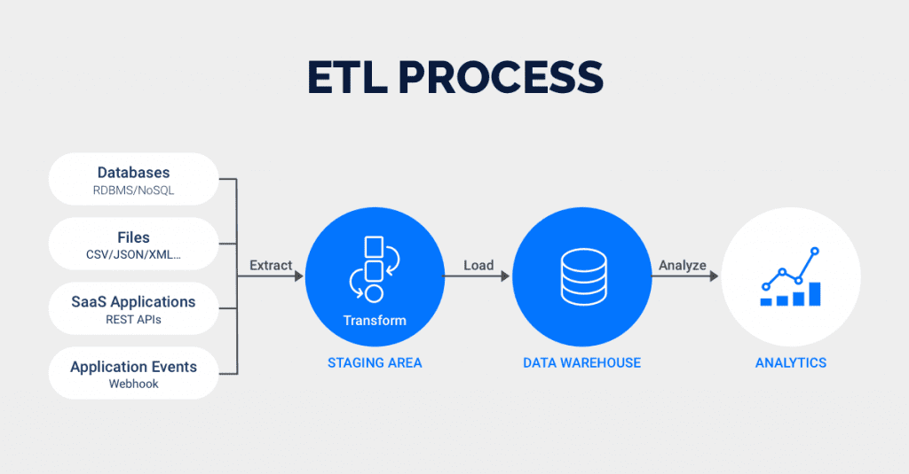
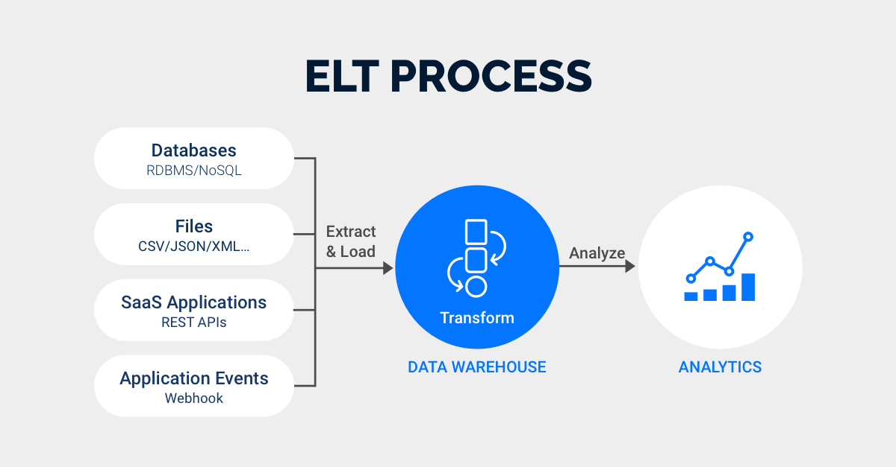

## Data Engineering

- The process of making data accessible for analysis.

- Data engineers build systems that collect, manager, and convert raw data into usable information.

- Some common tasks include developing algorithms to transform data into a more useful form, building database pipeline architectures, and creating new data analysis tools.

    - In our case, this will mainly be done on Microsoft Fabric.

## Data Engineer

- Designs, builds, and maintains the infrastructure and systems needed to collect, store, and process data for various business applications.

- Skills: Python, ETL tools, big data, cloud platforms

- Task:

    - Cleaning and transform raw data

    - Setting up data warehouses/lakes

## Extract, Transform, Load (ETL)

<figure markdown="span">

<figcaption>ETL Process (Rivery, 2024)</figcaption>
</figure>

- A process that involves extracting data from source systems, transforming it into a suitable format, and loading it into a target data store, transforming it into a suitable format, and loading it into a target data store.

- Older method ideal for complex transformations of smaller data sets.

    - Great for those prioritizing data security.

### Extract, Load, Transform (ELT)

<figure markdown="span">

<figcaption>ELT Process (Rivery, 2024)</figcaption>
</figure>

- Performs data transformations directly within the data warehouse itself.

- ELT allows for raw data to be sent directly to the data warehouse, eliminating the need for staging processes.

- A newer technology that provides more flexibility to analysts and is perfect for processing both structured and unstructured data.

### ETL vs. ELT

| Category                   | ETL (Extract, Transform, Load)                                                                 | ELT (Extract, Load, Transform)                                                               |
|----------------------------|-----------------------------------------------------------------------------------------------|-----------------------------------------------------------------------------------------------|
| Definition                 | Data is extracted from a source system, transformed on a secondary processing server, and loaded into a destination system. | Data is extracted from a source system, loaded into a destination system, and transformed inside the destination system. |
| Extract                    | Raw data is extracted using API connectors.                                                  | Raw data is extracted using API connectors.                                                  |
| Transform                  | Raw data is transformed on a processing server.                                              | Raw data is transformed inside the target system.                                            |
| Load                       | Transformed data is loaded into a destination system.                                        | Raw data is loaded directly into the target system.                                          |
| Speed                      | ETL is a time-intensive process; data is transformed before loading into a destination system. | ELT is faster by comparison; data is loaded directly into a destination system and transformed in-parallel. |
| Code-Based Transformations| Performed on secondary server. Best for compute-intensive transformations and pre-cleansing. | Performed in-database; supports simultaneous load and transform; improves speed and efficiency. |
| Maturity                   | Mature technology with 20+ years of development; practices and protocols are well-documented. | Relatively newer approach with evolving best practices and tooling.                          |
| Privacy                    | Pre-load transformation allows PII removal before loading; useful for compliance (e.g., HIPAA). | Direct loading requires strong in-database privacy safeguards and governance.                |
| Maintenance                | Requires maintenance of separate processing infrastructure.                                  | Lower maintenance burden due to fewer systems and unified architecture.                     |
| Costs                      | Can incur higher costs due to separate processing servers and staging environments.          | More cost-efficient due to simplified architecture and modern cloud services.               |
| Requeries                  | Raw data is not stored in the destination system, limiting the ability to requery unprocessed data. | Raw data is stored directly in the target system, allowing flexible and repeated querying.   |
| Data Lake Compatibility    | Not compatible with data lake architectures.                                                 | Compatible with data lakes and modern data platforms.                                       |
| Data Output                | Typically structured data.                                                                  | Supports structured, semi-structured, and unstructured data.                                |
| Data Volume                | Ideal for smaller datasets with complex transformation requirements.                        | Designed for large-scale data volumes with high throughput needs.                           |
| Use Cases                  | Legacy systems, on-premise data platforms, heavy pre-processing needs.                      | Cloud-native data platforms, real-time analytics, big data and data lake environments.      |
| Tool Examples              | Informatica, Talend, Apache Nifi, Microsoft SSIS.                                            | dbt, Azure Data Factory (pushdown), Google BigQuery SQL, Snowflake with native SQL.         |

#### Similarities

- Both involve Extracting, Transforming, and Loading data.

- Both aim to make data available for analytics and reporting.

- Both can be scheduled or orchestrated using data pipelines.

- Both support data integration across multiple sources.

#### Use Cases

| Scenario                                      | Use ETL                                           | Use ELT                                           |
|-----------------------------------------------|---------------------------------------------------|---------------------------------------------------|
| Legacy systems and on-premise databases       | Yes                                               | No                                                |
| Cloud-native data warehousing                | No                                                | Yes                                               |
| Real-time or near-real-time analytics         | No (higher latency)                               | Yes (faster ingestion and transformation)         |
| Heavy pre-processing required                 | Yes                                               | No                                                |
| Data lake architecture with large datasets    | No                                                | Yes                                               |

## Data Governance

- The formal plan for the way an organization manages company data.

- Data governance emcompassess rules for the way data is accessed and used, and can include acountability and compliance rules.

    - Defining and implementing policies, standards, and practices for managing and ensuring the quality, integrity, and security of data within an organization.

## Data Integrity

- Emcompasses the accuracy, reliability, and consistency of data over time.

- It involves maintaining the quality and reliability of data by implementing safeguards against unauthorized modifications, errors, or data loss. 

## Data Lake

- A centralized repository designed to capture and store a large amount of structured, semi-structured, and unstructured raw data.

- Unlike a data warehouse, a data lake does not impose a structure on the data before storage, providing flexibility for diverse analytics.

- Data scientists use the data in data lakes for machine learning or AI algorithms and models, or they can process the data and transfer it to a data warehouse.

## Data Modeling

- The process of mapping and building data pipelines that connect data sources for analysis.

    - Define structure of data and its relationships in a database or system.

    - It helps in understanding and designing how data will be stored and accessed.

- A data model is a tool that implements those pipelines and organizes data across data sources.

## Data Pipeline

- A series of processes hat move data from one system to another, typically involving multiple stages such as extraction, transformation, and loading.

    - These pipelines can be designed to operate in real-time (stream processing) or in scheduled intervals (batch processing).

- It ensures a smooth flow of data from source to destination.

## Data Warehouse

- A centralized data repository that stores processed, organized data from multiple sources.

- Data warehouses may contain a combination of current and historical data that has been extracted, transformed, and loaded from internal and external databases.

- Characteristics:

    - Usually contains large amounts of historical data.

    - considerable time and effort to create and maintain the warehouse.

    - (Optional) Can create Data Marts for better performance during exploitation by end users.

## Data Lakehouse

- A data lakeouse is an architectural approach that combines the flexibility of a data lake with the reliability and performance of a data warehouse.

    - Provides a unified platform for both analytical and transactional workloads.
    
## Data Mart

- A subset of a data warehouse that houses all processed data relevant to a specific department.

- While a data warehouse may contain data pertaining to the finance, marketing, sales, and human resources teams, a data mart may isolate the finance team data.

## Schema

- Defines the structure of a database or data warehouse, including tables, columns, relationships, and constraints. It serves as a blueprint for organizing and representing data.

## Distributed Systems

- Distributed systems involve the coordination and communication of multiple interconnected components across different machines.

- In the contet of data engineering, this is essential for scalability and fault tolerance.

## Data Scalability

- The ability of a system to handle growing amounts of data or increase workload.

- Data engineers design systems that can scale horizontally or vertically to meet performance requirements as data volumes increase.

## Data Integration

- Involves combining data from different sources to provide a unified view.

- It ensures that diverse datasets can work together seamlessly, often through ETL processes, to support analytics and reporting.

## Data Migration

- Data migration is the process of transferring data from one system to another.

- Data engineers need to plan and execute migrations carfully to ensure data integrity and minimize downtime.

## Data Orchestration

- Involves coordinating and managing the flow of data across various systems, services, and processes. It ensures that data workflows are executed in a controlled and organized manner.

## Data Mesh

- Data Mesh is a decentralized approach to data architecture that emphasizes domain-oriented dencentralized data ownership and infrastructure as code. 

- It aims to address scalability and agility in data systems.

## Data Ingestion

- Data ingestion is the process of collecting and importing data into a data system or storage layer.

- It involves azquiring data from various sources, such as databases, logs, or external APIs, for further processing.

## Data Bias

- Data bias occurs when datasets used for analysis or machine learning models contain systematic errors or favor specific groups, leading to biased results.

- Data engineers and data scientists must be aware of and address bias in data.

## Data Redundancy

- Data redundancy occurs when the same piece of data is unnecessarily duplicated and stored in multiple places within a database.

- While redundancy can be intentional for performance or data retrieval purposes, excessive redundancy can lead to inefficiencies and data integrity issues.

## Normalization

- Normalization is a database design technique that aims to minimize data redundancy and dependency by organizing data into separate tables.

- It involves breaking down a large table into smaller, related tables and establishing relationships between them.

## Data Workflow

- A data workflow refers to the series of steps, processes, and tasks involved in the end-to-end management and movement of data within an organization.

- This includes the collection, processing, storage, analysis, and distribution of data throughout its lifecycle.

## Online Transaction Processing (OLTP)

- OLTP systems manage transaction-oriented applications, typically involving large numbers of short online transactions such as insert, updatem and delete operations.

- These systems are optimized for fast query processing and maintaining data integrity in environments where multiple users perform transactions simultaneously.

- OLTP is commonly used in applications like banking, order processing, and retail, where real-time data access and reliability are critical.

## Online Analytical Processing (OLAP)

- Software technology you can use to analyze business data from different points of view.

- OLAP combines and groups the data into categories to provide actionable insights for strategic planning.

### OLTP vs. OLAP

| Feature                     | OLTP (Online Transaction Processing)                                | OLAP (Online Analytical Processing)                                   |
|----------------------------|----------------------------------------------------------------------|------------------------------------------------------------------------|
| **Purpose**                | Handles day-to-day transactional data                               | Supports complex analysis and decision-making                         |
| **Data Operations**        | Insert, Update, Delete, Short Queries                                | Read-heavy, Aggregate, Analytical Queries                             |
| **Data Volume**            | Handles large number of short online transactions                    | Handles large volumes of historical data                              |
| **Users**                  | Operational users (e.g., cashiers, clerks)                          | Business analysts, decision makers                                    |
| **Data Structure**         | Highly normalized schema (e.g., 3NF)                                 | Denormalized schema (e.g., star, snowflake)                           |
| **Query Complexity**       | Simple queries with fast response times                             | Complex queries involving joins, aggregations, and summarizations     |
| **Response Time**          | Milliseconds to seconds                                              | Seconds to minutes                                                    |
| **Data Freshness**         | Real-time or near real-time                                          | Periodically updated (e.g., hourly, daily)                            |
| **Examples**               | Banking transactions, order entry, retail sales                      | Sales trend analysis, forecasting, market segmentation                |
| **Database Design Goal**   | Speed and efficiency of transactions                                | Flexibility and speed of analytical queries                           |
| **System Type**            | Row-based databases                                                  | Columnar or hybrid storage databases                                  |
| **Backup and Recovery**    | Essential for data consistency and reliability                      | May be less frequent, often relies on data snapshots                  |

[:material-arrow-left: Big Data](./big_data.md){ .md-button }

[Data Analytics :material-arrow-right:](./data_analytics.md){ .md-button }

