# Data Visualization

## Charts

### Bar & Column Charts

<figure markdown="span">
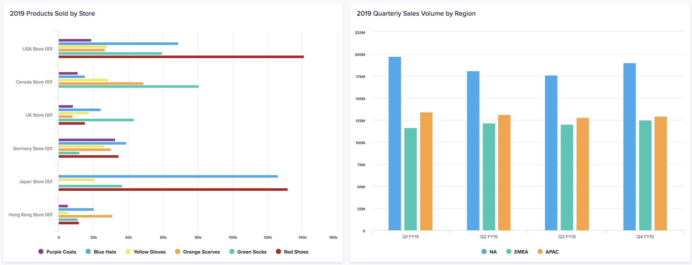
<figcaption>Bar and Column Chart Example (Anapedia, 2024)</figcaption>
</figure>

- Bar charts: reserved for charts where the categories appear on the vertical axis.

- Column charts: those where categories appear on the horizontal axis.

    - In either case, the chart has a series of categories along one axis.

    - Extending rightwards (or upwards) from each category is a rectangle whose width (height) is proportional to the value associated with this category.

- Sometimes the bars are clustered to allow multiple series to be charted side-by-side.

### Bubble Charts

<figure markdown="span">

<figcaption>Bubble Chart Example (NetSuite, 2021)</figcaption>
</figure>

- Used to display three dimensions of data on a two dimensional chart.

- A circle is placed with its centre at a value on the horizontal and vertical axes according to the first two dimensions of data, and the area of the circle reflects the third dimension.

    - Research suggests that humans are more attuned to the comparing areas of circles than say their diameters.

### Cartograms

<figure markdown="span">
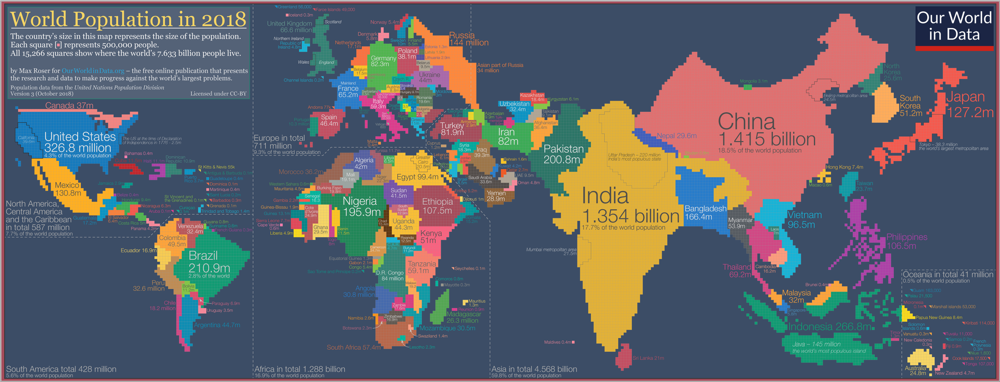
<figcaption>Cartogram Example (Max Roser - Our World in Data)</figcaption>
</figure>

- A geographic map where areas of map sections are changed to be proportional to some other value; resulting in a distorted map.

- In the diagram, we can see that the mosaic cartogram shows the distribution of the global population. Each of the 15,266 pixels represents the home country of 500,000 people. 

### Histograms

<figure markdown="span">
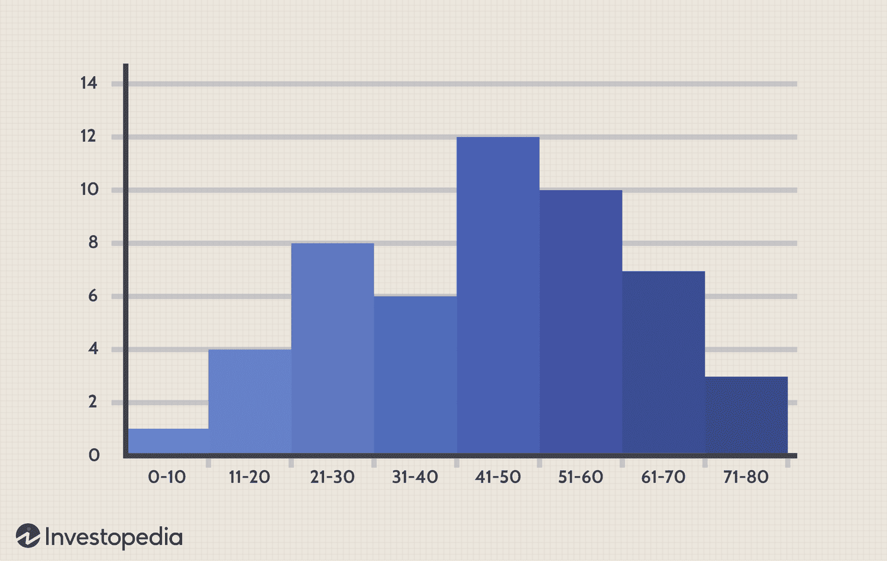
<figcaption>Histogram Example (James Chen - Investopedia, 2024)</figcaption>
</figure>

- A type of Bar Chart (categories along the horizontal axis) where the categories are bins (or buckets) and the bars are proportional to the number of items falling into a bin.

- In the diagram, there are 8 bins, with each bar representing the frequency of the data falling into each bin. Thus, from the histogram we can see that '41-50' has the highest frequency of occurrence.

### Line Charts

<figure markdown="span">
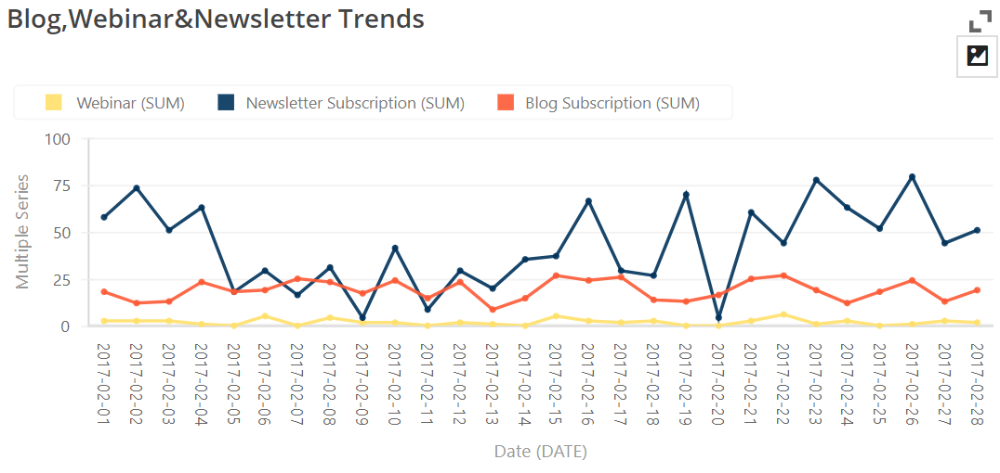
<figcaption>Line Chart Example (BusinessQ, 2019)</figcaption>
</figure>

- These typically have categories across the horizontal axis and could be considered as a set of line segments joining up the tops off what would be the rectangles on a Bar chart.

- Multiple lines, associted with multiple series, can be plotted simultaneously without the need to cluster rectangles as is required with Bar Chart.

    - Multiple series shown in the diagram above.

### Map Charts

<figure markdown="span">
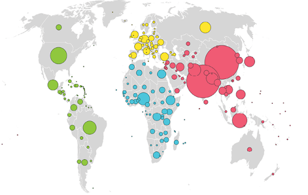
<figcaption>Map Chart Example (GapMinder)</figcaption>
</figure>

- Place data on top of geographic maps.

- For example, if we use a map of the US, the degree of shading of each state could be proportional to some state-related data (e.g.: average income quartile of residents). Or more simply, figures could appear against each state.

    - Alternatively, similar to the diagram above, bubbles could be placed at the location of major cities (or maybe a bubble per country or state etc.) with their size relating to some aspect of the locale (e.g. population).

    - Data can also be overlaid on a map, for example coloured bands showing different intensities of rainfall in different areas.

### Pie Charts

<figure markdown="span">
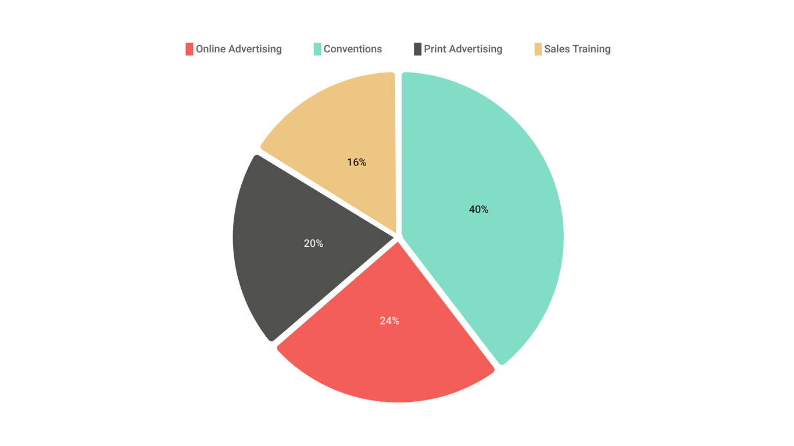
<figcaption>Pie Chart Example (Moqups)</figcaption>
</figure>

- These circular charts normally display a single series of categories with values, showing the proportion each category value is of the total.

    - Sometimes the segments are "exploded" away from each other.

- For example a series might be the nations that make up the United Kingdom and their populations: England 55.62 million people, Scotland 5.43 million, Wales 3.13 million and Northern Ireland 1.87 million.

    - The whole circle represents the total of all the category values (e.g. the UK population of 66.05 million people).

    - The ratio of a segment’s angle to 360° (i.e. the whole circle) is equal to the percentage of the total represented by the linked category’s value (e.g. Scotland is 8.2% of the UK population and so will have a segment with an angle of just under 30°).

### Waterfall Chart

<figure markdown="span">

<figcaption>Waterfall Chart Example (Eugenia Anello - DataCamp, 2025)</figcaption>
</figure>

- A data visualization technique that shows how an initial value can be affected by the cumulative effect of sequential positive and negative values.

     - This chart can be used to show either sequential or categorical data.

     - It uses a series of bars that show gains and losses, clearly showing how an opening figure was changed by events and led to the closing figure.

## International Business Communication Standards (IBCS)

- There are 3 pillars to IBCS:

     - Conceptual rules

        - How to organise content such that the message gets across

    - Perceptual rules

        - Which visualizations to use in each case

    - Semantic rules

         - Actual standardization of business communication.

         - Terminology, descriptions, dimensions, analyses, indicators, etc.

### Top 5 IBCS Recommendations

- Present time series with horizontal axis

    <figure markdown="span">
    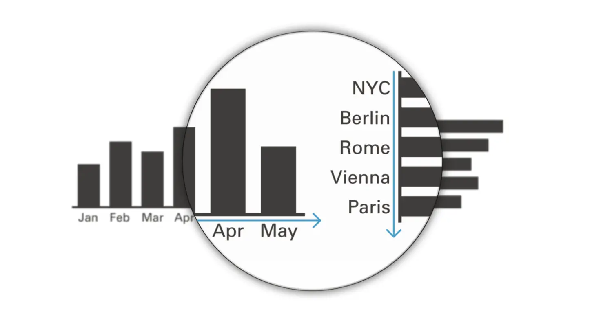
    <figcaption>IBCS Axis Example (Zebra BI)</figcaption>
    </figure>

    - 2 types of series: time and structure

        - Time series: horizontal axis (*E.g.: months, years, quarters, days, etc.*)

        - Structural comparison: vertical axis (*E.g.: cities/location, projects, type of revenue, etc.*)

- Unify the titles of pages, charts, and tables

    <figure markdown="span">
    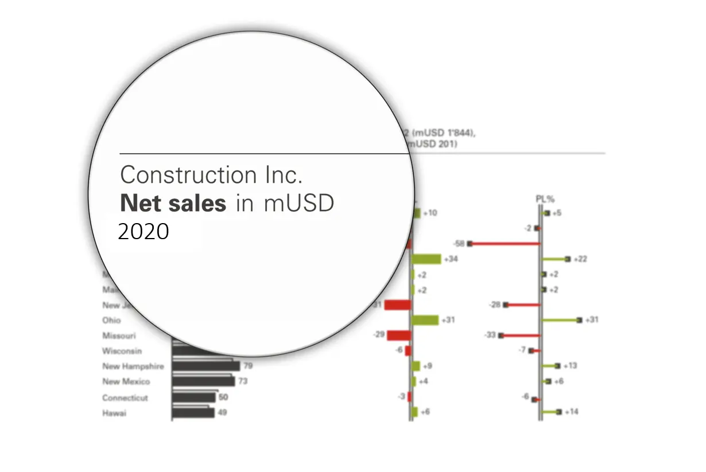
    <figcaption>IBCS Title Example (Zebra BI)</figcaption>
    </figure>
    
    - Subject: company, a division, country, or store name

    - Measure with units: measure is the quantity that you are showing.

        - E.g.: your profits, loss statements, net sales, etc.

    - Time period: period of which you are showig the data (*e.g.: January 2021*)

- Identify scenarios by fill pattern

    <figure markdown="span">
    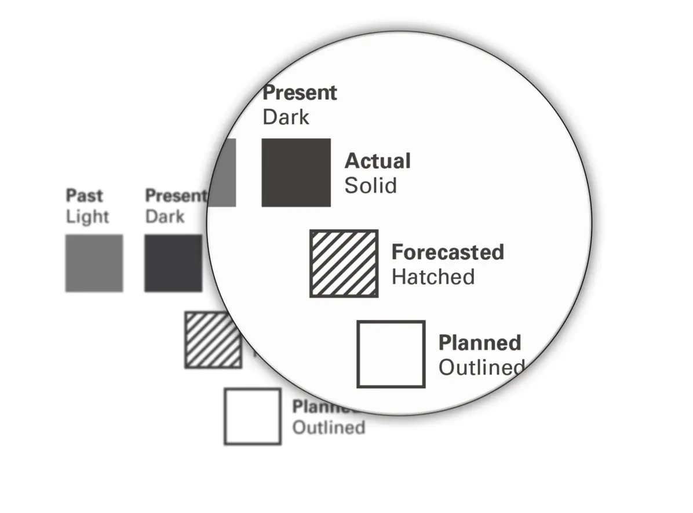
    <figcaption>IBCS Fill Example (Zebra BI)</figcaption>
    </figure>

     - Solid fill: actual values

     - Hatched: forecast values

     - Outlined: planned

- Highlight variances with green and red

    <figure markdown="span">
    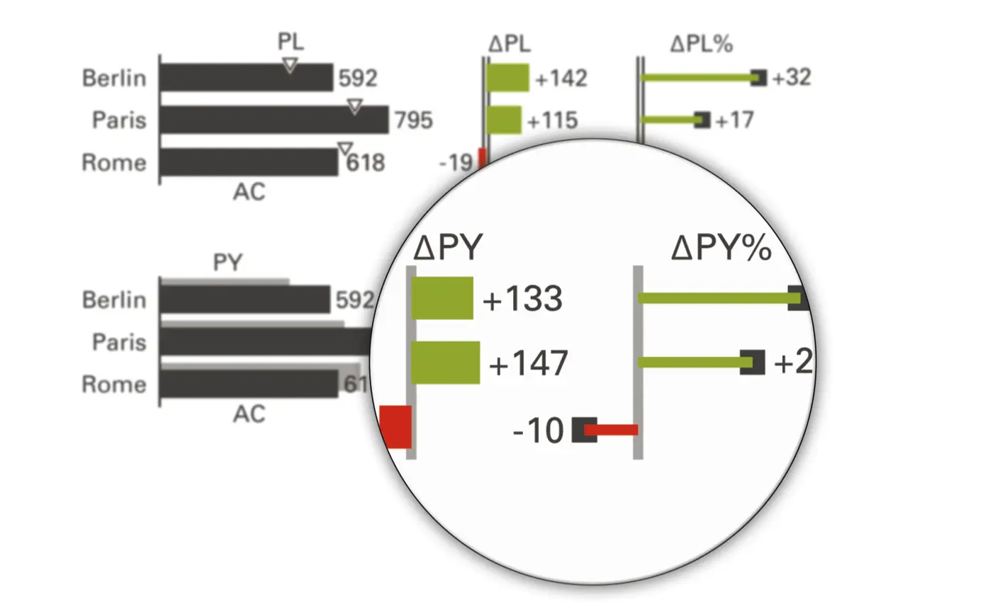
    <figcaption>IBCS Color Example (Zebra BI)</figcaption>
    </figure>

     - Usually cimple charts in black and white, colors are only reserved for important things

     - Red: negative variances, green: positive variances

     - Negative variances does not necessarily mean negative number

        - An increase in costs is a positive value that is negative variance

- Use highlighting to get message across

    <figure markdown="span">
    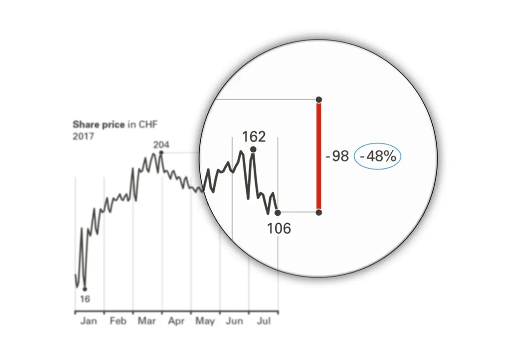
    <figcaption>IBCS Highlight Example (Zebra BI)</figcaption>
    </figure>

    - E.g.: highlighting differences between highest and lowest values

    

    
    [:material-arrow-left: Data Analytics](./data_analytics.md){ .md-button }
    
    [Data Science :material-arrow-right:](./data_science.md){ .md-button }
    
    
