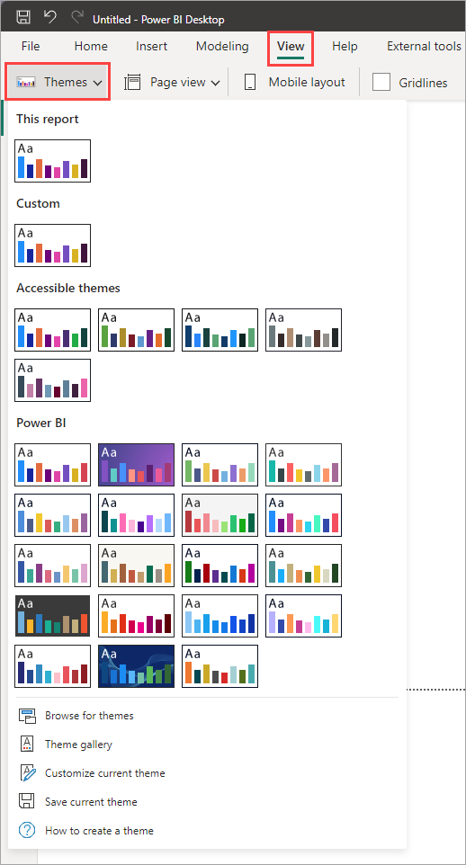

# Best Dashboard Design Practices

## Understand the Business Context and Audience

- **Executive Dashboards**: Focus on high-level KPIs like revenue growth, profit margins, or customer satisfaction trends. Keep visualizations concise and impactful.

- **Operational Dashboards**: Highlight process metrics, such as daily production efficiency or supply chain performance, with real-time data analytics.

- **Analytical Dashboards**: Offer drill-down capabilties and granular data for power users to explore.

## Simplify the User Experience with Intuitive Navigation

- Multi-page reports and complex datasets can overwhelm users, so thoughtful navigation is essential.

- Filters or bookmarks can be used to make navigation between pages or segments of data easier.

    - Filters: allow executives to focus on different segments of data with a single click.

    - Bookmarks and buttons: allow executives to navigative between different pages easily.

### Traditional vs. Optimized Navigation

| Traditional Navigation       | Optimized Navigation                  |
|-----------------------------|----------------------------------------|
| Overloaded with filters     | Contextual filters only                |
| Unclear tab names           | Descriptive, user-friendly labels      |
| Data visual clutter         | Logical grouping of visuals            |

## Create a Clear Visual Hierarchy

- Effective Power BI UI design ensures users can see the big picture first and dive deeper into details when needed. A clear visual hierarchy organizes information logically.

- Example layout:

    - **Top Section**: high-level KPIs (e.g.: revenue, expenses, net profit).

    - **Middle Section**: supporting charts (e.g.: sales trends, regional performance).

        - This should represent trend-based data including activity-based metrics, and visuals that demonstrate data over time. 

        - Best suited for larger visuals.

    - **Bottom Section**: detailed data tables or supplementary visuals (e.g.: KPIs, or Tables).

## Design Checklist

- Ensure you are visualizing 6-10 insights per page.

- Match the right insights with the correct visual.

    <figure markdown="span">
    .png)
    <figcaption>Power BI Visualizations by Category (Numerro, 2022)</figcaption>
    </figure>

- Use a logical layout by grouping related metrics.

    <figure markdown="span">
    .png)
    <figcaption>Power BI Logical Layout (Numerro, 2022)</figcaption>
    </figure>

- Ensure the correct sizing of visuals.

    <figure markdown="span">
    
    <figcaption>Power BI Visual Sizing Guide (Numerro, 2022)</figcaption>
    </figure>

- Apply suitable margin and padding.

    - When working with boxes, be generous with the margin outside of the boxes between visuals, and then padding within each visuals box.

    - This allows the content in the box more room to breathe and becomes more legible for the end user.

- Apply a visual hierarchy.

    - Visual hierarchy is about making elements of different importance stand out accordingly on the dashboard. 

    - In this example, the numeric value is more important than the textual description, so you can increase the font size and the font-weight to make it stand out. 

        - The subheading can be de-emphasized through smaller font size, lighter colour, and wider letter spacing.

    <figure markdown="span">
    .png)
    <figcaption>Power BI Example of Visual Hierarchy (Numerro, 2022)</figcaption>
    </figure>

- Use a consistent colour palette.

    - Build your own colour palette to stay consistent when using colours across your report. Usng a colour palette helps you understand which colour to use for certain aspects of a report.

- Use distinguishable colours with enough contrast.

    - Use colour that are easy to distinguish between one another, e.g. using contrasting colours compared to shades of the same colour, as this can make it hard to tell the difference. 

    <figure markdown="span">
    .png)
    <figcaption>Power BI Example Color Contrast (Numerro, 2022)</figcaption>
    </figure>

- Use a consistent theme.

    - Ensure you stay consistent with you theme's colour palette across your visuals, and limit the number of colours per visual, maximum 6.

- Add clear headings and labels.

    - Helps to add clarity and context to the information you've provided.

    - This principle will also give your audience the ability to extract valuable insights at a glance, eliminating any confusion.

- Round your numbers where necessary.

## Consistency in Branding and Design

- Consistency reinforces credibility and ensures a professional look and feel. Your dashboard should align with the organization's branding standards.

- Branding elements to include:

    - Company logo, placed subtly.

    - Brand colors for charts, graphs, and accents.

    - Fonts and typography consistent with corporate identity.

- Use Power BI's theme customization feature as shown below to apply consistent branding across all reports.

    <figure markdown="span">
    
    <figcaption>Themes for Dashboards (aufaitUX, 2025)</figcaption>
    </figure>

## Design for Mobile and Desktop Experiences

- Use Power BI's Mobile Layout to create device-specific views.

- Prioritize essential metrics and visuals for smaller screens.

- Test the dashboard on different devices to ensure responsiveness.

### Mobile vs. Desktop Dashboard Design

| Mobile Design                         | Desktop Design                          |
|--------------------------------------|-----------------------------------------|
| Minimal visuals, focus on KPIs       | Comprehensive data visualization        |
| Large buttons for touch screens      | Interactive slicers and tooltips        |
| Simplified navigation                | Detailed multi-page navigation          |

## Optimize Use of White Space

- White space isn't wasted space; it's a design element that creates balance and reduces visual clutter.

- Why white space matters:

    - Enhances readability and focus.

    - Prevents data overload by separating visuals.

    - Creates a clean, professional aesthetic.

- Use gridlines and alignment tools in Power BI to space out visuals evenly.

## Colour with Purpose

- Best practices for color:

    - Use a limited palette to maintain coherence.

    - Apply consistent colours for recurring categories (e.g.: blue for revenue, green for growth).

    - Leverage contrast for reability (e.g.: dark text on light backgrounds).

- What to avoid:

    - Overuse of bright, distracting colours.

    - Relying on colour alone to convey information (ensure accessibility for colourblind users).

## Maximize Interactivity

- Interactivity transforms static dashboards into dynamic tools that empower users to explore data.

- Interactive features to include:

    - **Slicers and filters**: allow users to segment data by time, region, or category.

    - **Drill-throughs**: enable deep dives into specific data points.

    - **Tooltips**: provide additional context without cluttering the visuals.

- Keep interactivity intuitive and avoid overloading users with too many options.

## Ensure Data Accuracy and Clarity

- Data integrity is non-negotiable. Even the most visually stunning dashboard loses credibility if the data is flawed. 

- Tips for accurate data presentation:

    - Use consistent formatting for dates, numbers, and currencies.

    - Validate data sources and refresh schedules.

    - Avoid overloading visuals with excessive data points.

## Test, Iterate, and Improve

- Dashboards evolve with user feedback and business needs. Regular testing ensures your Power BI designs remain relevant and effective.

- Testing checklist:

    - Are objectives being met?

    - Is navigation seamless?

    - Are visuals loading quickly?

    - Is data accurate and up-to-date?

- Use Power BI's usage analytics to monitor how users interact with your dashboard.