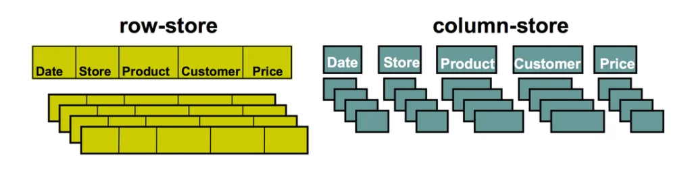

# VertiPaq Engine

- Can be understood as the "brain and muscles" of the system behind not only Power BI, but also SSAS Tabular and Excel Power Pivot. 

- When you send the query to get data for your Power BI report, here is what happens:

    - **Formula Engine (FE)** accepts the request, process it, generates the query plan and finally executes it.

    - **Storage Engine (SE)** pulls the data out of Tabular model to stisfy the request issed within the query generated by the Formula Engine.

- Storage Engine works in two different ways in order to retrieve requested data: VertiPaq keeps the snapshot of the data in-memory, This snapshot can be refreshed from time to time, from the original data source.

    - DirectQuery doesn't store any data. It just forwards the query straight to the data source for every single request.

## Formula Engine

- Formula Engine accepts the query, and since it's able to "understand" DAX, it "translates" DAX into a specific query plan, consisting of physical operations that need to be executed in order to get resuts back.

- Physical operations: joins between multiple tables, filtering, or aggregations.

    - Requests to Storage Engine are always being sent sequentially.

## Storage Engine

- Once the query has been generated and executed by the Formula Engine, the Storage Engine comes into the scene. It physically goes through the data stored within the Tabular model (VertiPaq) or goes directly to a different data source (E.g.: if DirectQuery mode is in place, SQL Server).

- There are 3 options when specifiying the storage engine for the table:

    - **Import mode**: based on VertiPaq. Table data is being stored in-memory as a snapshot. Data can be refrehed periodically.

    - **DirectQuery mode**: data is being retrieved from the data source at the query time. Data resides in its original source before, during and after the query execution.

    - **Dual mode**: combination of the first two options. Data from the table is being loaded into memory, but at the query time it can be also retrieved directly from the source.

- As opposed to the Formula Engine that doesn't support parallelism, the Storage Engine can work asynchronously.

## VertiPaq Storage Engine

- When we choose Import mode for our Power BI tables, VertiPaq performs the following actions:

    - Reads the data source, transforms data into columnar structure, encodes and compresses data within each of the columns.

    - Establishes dictionary and index for each of the columns.

    - Prepares and establishes relationships.

    - Computes all calculated columns and calculated tables and compresses them.

- Two main characteristics of VertiPaq are:

    - VertiPaq is a columnar database.

    - VertiPaq is an in-memory database.

        <figure markdown="span">
        
        <figcaption>Row-Store vs. Column-Store (Data Mozart, 2021)</figcaption>
        </figure>

        - Columnar databases are optimized for vertical data scanning, which means that every column is structured in its own way and physically separated from other columns.

- With columnar databases, single column access is fast and effective. Once the computation starts to involve multiple columns, things become more complex, as intermediary steps' results need to be temporarily stored in some way.

    - Simply said, columnar databases are more CPU exhaustive, while row-store databases increase I/O, because of many scans of useless data.