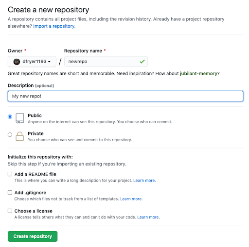
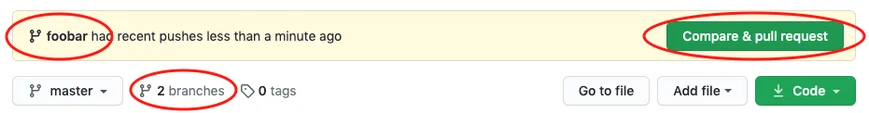
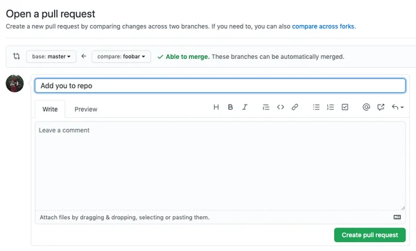
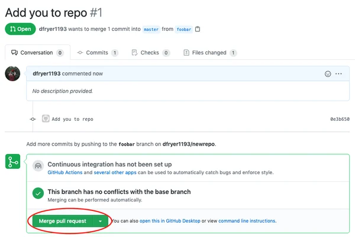
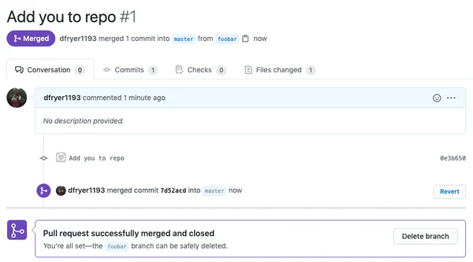
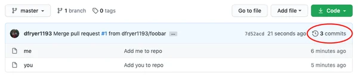

# Git

## Installing Git and Github

Follow [this link](https://git-scm.com/book/en/v2/Getting-Started-Installing-Git) to find the steps to install Git.

Once Git has been installed, follow [this link](https://product.hubspot.com/blog/git-and-github-tutorial-for-beginners) to create a Github account.

### Git vs. Github

- Git is an open-source, version control tool created in 2005 by developers working on the Linux operating system.

- Github is a company foudned in 2008 that makes tools which integrate with Git.

- You do not need Github to use Git, but you cannot use GitHub without using Git.

## Step 1: Create a local git repository

- You typically obtain a Git repository in one of two ways:

    - You can take a local directory that is currently not under version control, and turn it into a Git repository, or

    - You can `clone` an existing Git repository from elsewhere.

### Existing Directory

- If you have a project directory that is currently not under version control and you want to start controlling it with Git, you first need to go to that project's directory. 

    ```PowerShell
    cd /home/user/my_project
    ```
- After that, type the command below to initialize a git repository in the root of the folder:

    ```PowerShell
    git init
    ```

### Cloning an Existing Repository

- You clone a repository with `git clone <url>`. For example, if you want to clone the Git linkable library called `libgit2`, you can do so like this:

    ```PowerShell
    git clone https://github.com/libgit2/libgit2
    ```
    - That creates a directory named `libgit2`, initializes a `.git` directory inside it, pulls down all the data for that repository, and checks out a working copy of the latest version.

    - If you go into the new `libgit2` directory that was just created, you'll see the project files in there, ready to be worked on or used.

- If you want to clone the repository into a directory named something other than `libgit2`, you can specify the new directory name as an additional argument:

    ```PowerShell
    git clone https://github.com/libgit2/libgit2 mylibgit
    ```

## Step 2: Add a new file to the repo

- To create a new file, run a [touch](https://linux.die.net/man/1/touch) command.

    - `touch newfile.txt` just creates and saves a blank file named newfile.txt.

- Once you've added or modified files in a folder containing the git repo, git will notice that the file exists inside the repo.

    - Git will not track the file unless you explicitly tell it to. 

    - Git only saves/manages changes to files that it tracks, so we need to send a command to confirm that we want Git to track our new file.

- After creating the new file, you can use the git status command to see which files Git knows exist.

## Step 3: Add a file to the staging environment

- Add a file to the staging environment using the git add command.

- If you rerun the git status command, you'll see that git has added the file to the staging environment. 

*The file has not yet been added to a commit, but it's about to be.*

## Step 4: Create a commit

- Run:

    ```Powershell
    git commit -m "Your message about the commit"
    ```

- The commit message should be something related to what the commit contains.

    - When a clear explanation is given, it helps future programmers figure out why some changes were made years later.

## Step 5: Create a new branch

- Branches allow you to move back and forth between 'states' of a project.

    - Official Git docs: "A branch in Git is simply a lightweight movable pointer to one of these commits".

- When you create a new branch, Git keeps track of which commit your branch 'branched' off of, so it knows the history behind all the files.

- To create a new branch, run:

    ```Powershell
    git checkout -b <branch-name>
    ```

    - This command automatically creates a new branch and then 'checks you out' on it, meaning Git will move you to that branch, off of the primary branch.

- After running to command above, you can use `git branch` command to confirm that your branch was created.

    - The branch name with the asterisk next to it indicates which branch you're on at the given time. 

## Step 6: Create a new repository on Github

- If you only want to keep track of your code locally, you don't need to use Github.

- If you want to work with a team, you can use Github to collaboratively modify the project's code.

- To create a new repository on Github, log in and go to the Github home page. 

    - You can find the "New repository" option under the "+" sign next to your profile picture, in the top right corner of the navbar.

        <figure markdown="span">
        
        <figcaption>Create A New Repository in Github (HubSpot, 2020)</figcaption>
        </figure>

    - After clicking the button, Github will ask you to name your repository and provide a brief description:

        <figure markdown="span">
        
        <figcaption>Creating a Repository (HubSpot, 2020)</figcaption>
        </figure>

        - When you're done filling out the information, press the 'Create repository' button to make your new repository.

    - Github will ask if you want to create a new repository from scratch or if you want to add a repository you have created locally. 

        - If you already have an existing local repository, follow the '...or push an existing repository from the command line' section.

        - Generally, the code would be: `git remote add origin {link_from_github}`.

## Step 7: Push a branch to Github

- This allows other people to see the changes you've made.

    - If they're approved by the repository's owner, the changes can then be merged into the primary branch.

- To push changes onto a new branch on Github, you'll want to run `git push origin {your_branch_name}`.

    - Github will automatically create the branch for you on the remote repository. 

- If you refresh the Github page, you'll see a note saying that you have just pushed a branch into the repository.

    - You can also click the 'branches' link to see your branch listed there.

        <figure markdown="span">
        
        <figcaption>Compare & pull request (HubSpot, 2020)</figcaption>
        </figure>

## Step 8: Create a pull request (PR)

- A pull request (or PR) is a way to alert a repo's owners that you want to make some changes to their code.

    - It allows them to review the code and make sure it looks good before putting your changes on the primary branch.

- This is what the PR page looks like before you've submitted it:

    <figure markdown="span">
    
    <figcaption>Open a pull request (HubSpot, 2020)</figcaption>
    </figure>

- This is what it looks like once you've submitted the PR request:

    <figure markdown="span">
    
    <figcaption>Submitted pull request (HubSpot, 2020)</figcaption>
    </figure>

## Step 9: Merge a PR

- Click the 'Merge pull request' button. This will merge your changes into the primary branch.

    <figure markdown="span">
    
    <figcaption>Merged pull request (HubSpot, 2020)</figcaption>
    </figure>

- You can double check that your commits were merged by clicking on the 'Commits' link on the first page of your new repository.

    <figure markdown="span">
    
    <figcaption>Commits (HubSpot, 2020)</figcaption>
    </figure>

    - This will show you a list of all commits in that branch. 

## Step 10: Get changes on Github back to your computer

- In order to get the most recent changes that you or others have merged on Github, use `git pull origin main` command.

- This shows you all the files that have changed and how they've changed.

- if you want to update your local main file, you can change to the main branch by using `git checkout main` command.