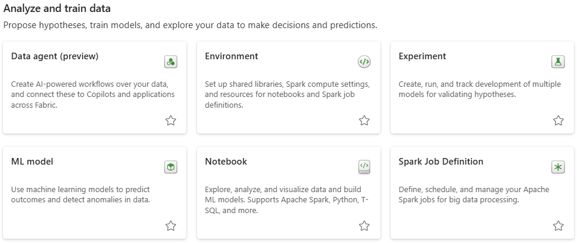

# Analyze and Train Data

<figure markdown="span">

<figcaption>Fabric Items Under "Analyze and Train Data"</figcaption>
</figure>

In this section, we will be defining the Environment and ML Model items, since Notebook and Spark Job Definition were already defined previously.

## Environment

- Logical container in Microsoft Fabric used to group and manage related resources like Lakehouses, Warehouses, Pipelines, and Notebooks.

- Controls access, security, and compute settings across all items within the environment.

     - Once it is set up, you can attch it to your Spark Job definition, as well as Notebooks. Then, ass the libraries and the configurations will be there when the session gets started.

     - All the configuration libraries can be patched together, seamless code experience.

- Supports collaboration and governance, making it easier to organize projects and apply consistent policies.

For more information, refer to [Using Fabric Tools: Environment](../fabric_tools/environment.md).

## ML Model

- Machine Learning (ML) models are trained algorithms that learn patterns from data to make predictions or classifications.

- In Fabric, ML models can be created, trained, and deployed within Notebooks, Pipelines, or integrated environments.

- They support a range of use cases such as forecasting, classification, recommendation systems, and anomaly detection.

Refer to [Using Fabric Tools: ML Model](../fabric_tools/ml_model.md).

[:material-arrow-left: Prepare Data](./prepare_data.md){ .md-button }

