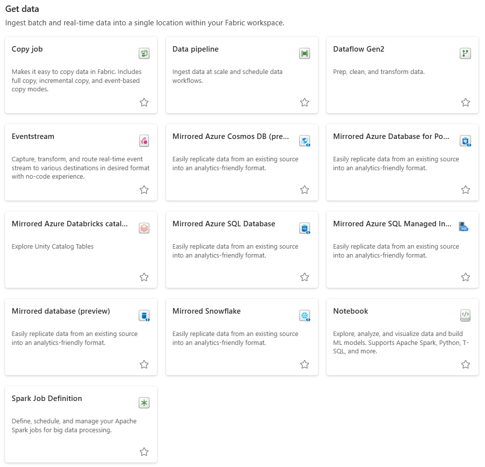

# Get Data

<figure markdown="span">

<figcaption>Fabric Items Under "Get Data"</figcaption>
</figure>

While there are many items that can be utilized under "Get Data", the main ones that are used are: copy job, data pipelines, dataflow Gen2, and notebook. Thus, these items will be defined and explained below.

## Data Pipelines

- Data orchestration tool in Microsoft Fabric that automates the movement and transformation of data across different sources and destinations.

- Supports low-code and code-first experiences, allowing users to create dataflows with drag-and-drop activities or advanced custom logic.

- Integrates seamlessly with Fabric services like Lakehouse, Warehouse, and Real-Time Analytics for end-to-end data management and analysis.

     - Efficient at importing data from the cloud (e.g., ADLS, Azure SQL).

- Can trigger a variety of actions in Fabric:

    - Dataflow Gen2

    - Notebooks

    - Stored Procedures

    - KQL script

    - Generic webhooks

    - Azure Functions

    - Azure Databricks

    - Azure ML

- Con: Cannot access on-premises data.

- Con: Does not have ability to do transformation on its own but can embed Notebooks or Dataflows to perform that task.

- Con: Does not work cross-workspace as of now.

For more information on Data Pipelines, refer to [Using Fabric Tools: Data Pipelines](../fabric_tools/pipelines.md).

## Copy Job

- Data movement activity that efficiently copies data from a source to a destination within the Microsoft Fabric ecosystem.

- Supports a wide range of connectors, enabling transfers between databases, cloud storage, APIs, and Fabric-native stores.

- Optimized for high performance, handling large-scale data loads with options for incremental copy, parallelism, and schema mapping.

- Copy Job is a simplified, user-friendly way to move data, while a Data Pipeline is a more complex, flexible solution that can handle data ingestion and more.

- Does incremental copy of the data. This means that it initially copies all data, and subsequent runs copy only changes.

    - Does not capture deleted rows.

## Dataflow Gen2

- Data preparation tool that enables users to ingest, transform, and cleanse data using a visual, low-code interface.

    - Can do Extract, Transform and Load tasks using familiar Power Query interface.

- Built on Fabric’s unified data platform, allowing direct output to Lakehouses, Warehouses, and other Fabric items.

- Supports complex transformations with features like incremental refresh, computed columns, and integration with pipelines.

    - Can combine more than one dataset in a dataflow.

- Since most files are stored in Sharepoint, this is the main method to bring in data.

- Con: Struggles with large datasets, which can be costly if you are transforming loads of data regularly.

More information is available at [Using Fabric Tools: Dataflow Gen2](../fabric_tools/dataflow.md)

## Notebook

- Interactive development environment for writing and executing code in languages like Python, SQL, and Spark.

- Integrated with Fabric’s compute and storage, allowing direct access to Lakehouses and other data assets.

    - Can be used to bring data into Fabric via connecting to API’s or client Python libraries.

- Supports data exploration, machine learning, and automation with rich outputs like charts, tables, and visualizations.

    - Can do data validation on incoming data.

Refer to [Using Fabric Tools: Notebook](../fabric_tools/notebook.md) for more information.

## Comparing All Methods

| Category                    | Pipeline Copy Activity | Dataflow Gen 2 | Spark | Notebook |
|------------------------------|-------------------------|----------------|-------|-----------|
| **Use case**                 | Data lake and data warehouse migration, data ingestion, lightweight transformation | Data ingestion, data transformation, data wrangling, data profiling | Data ingestion, data transformation, data processing, data profiling | Data exploration, transformation, machine learning, automation |
| **Primary developer persona** | Data engineer, data integrator | Data engineer, data integrator, business analyst | Data integrator, data engineer | Data scientist, data engineer, analyst |
| **Primary developer skill set** | ETL, SQL, JSON | ETL, M, SQL | Spark (Scala, Python, Spark SQL, R) | Python, SQL, Spark, machine learning |
| **Code written**             | No code, low code | No code, low code | Code | Code |
| **Data volume**              | Low to high | Low to high | Low to high | Low to high |
| **Development interface**    | Wizard, canvas | Power Query | Notebook, Spark job definition | Notebook |
| **Sources**                  | 30+ connectors | 150+ connectors | Hundreds of Spark libraries | Lakehouse, Warehouse, Spark tables, external sources via code |
| **Destinations**             | 18+ connectors | Lakehouse, Azure SQL Database, Azure Data Explorer, Azure Synapse Analytics | Hundreds of Spark libraries | Lakehouse, Warehouse, visualization outputs |
| **Transformation complexity**| Low: lightweight - type conversion, column mapping, merge/split files, flatten hierarchy | Low to high: 300+ transformation functions | Low to high: support for native Spark and open-source libraries | Low to high: custom transformations using Python, SQL, Spark |

[Store Data :material-arrow-right:](./store_data.md){ .md-button }

