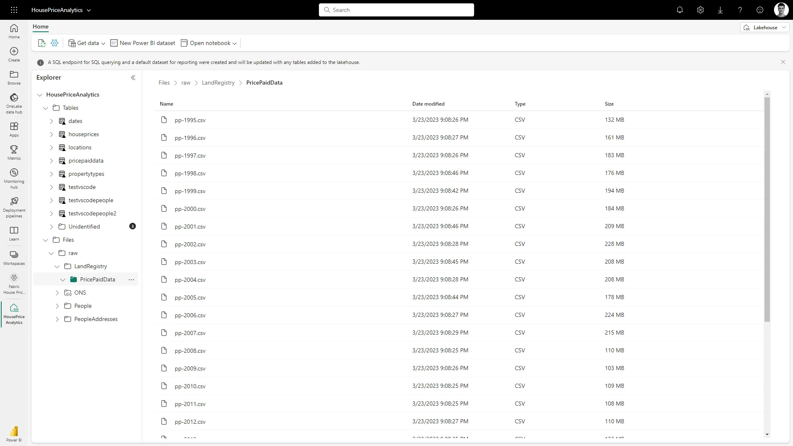

# OneLake

- OneLake is a single, unified, logical data lake for your whole organization. A data lake processes large volumes of data from various sources. Like OneDrive, OneLake comes automatically with every Microsoft Fabric tenant and is designed to be the single place for all your analytics data.

- OneLake is the core of Microsoft Fabric - it is essentially the storage account for all of your data utilized within Fabric, be that within Azure or from another cloud.

## Shortcuts

- They allow you to connect you to your data which reside elsewhere. This could be files/tables from other Fabric workspaces, or external ADLS Gen2/AWS S3 accounts.

- This will reduce the need for duplication and unnecessary data copy, but only if your source data is stored in one of the above data stores. Maybe other supported "shortcut" sources will come in the future.

- Shortcuts can be created from any type of file, or a "Delta" table.

    - If you create a shortcut to a Delta table (created from Databricks, for example) and you place this shortcut at the top level of the "Tables" directory in OneLake*, then that Delta table should be automatically recognized and made available for querying in your Lakehouse.

## Exploring OneLake

### Lakehouse view

- This can be viewed within the Fabric UI. Tables and files can be browsed using a familiar folder structure, as per the below screenshot. 

- Certain file types can be previewed (like CSV/JSON), other file types can't (e.g. parquet).

    <figure markdown="span">
    
    <figcaption>OneLake UI (endjin, 2023)</figcaption>
    </figure>

### OneLake File Explorer

- This mounts your OneLake to your Windows file explorer, just like the OneDrive File Explorer. 

    - This makes it easy to upload/browse/interact with files locally. 

- If you need to inteact with a file, then you must double click it to have it downloaded. 

## Key benefits and Drawback of OneLake

### Benefits

- No infrastructure to manage (since it's SaaS).

- All organizational data stored in same, logical storage account.

- Each worksapce can have its own admins/access policies/region assignment.

- Unified governance policies easier to enforce.

- Compatibility with most ADLS Gen2 APIs (and a subset of blob storage APIs).

- OneLake File Explorer.

- Interoperability (enabled by using the Delta open table format).

### Drawbacks

- Less configurable than ADLS.

- One OneLake per tenant might make strict multi-tenanted Fabric scenarios harder to sell to the security team. A separated OneLake would require a separate AAD tenant (just like Power BI).

[:material-arrow-left: Analyze and Train Data](./analyze_train_data.md){ .md-button }

