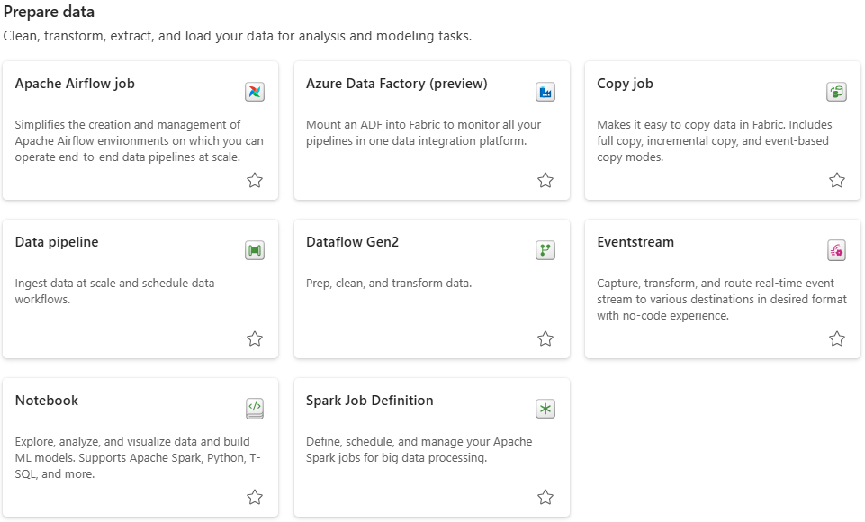

# Prepare Data

<figure markdown="span">

<figcaption>Fabric Items Under "Prepare Data"</figcaption>
</figure>

Since Copy Job, Data Pipeline, Dataflow Gen2, and Notebooks have already been defined under [Get Data](./get_data.md), we will only define Apache Airflow Job and Spark Job Definition in this section.

## Apache Airflow Job

- Powered by [Apache Airflow](https://airflow.apache.org/).

- Task orchestration framework that schedules and manages complex workflows as Directed Acyclic Graphs (DAGs).

- Code-first approach where developers define workflows using Python scripts, enabling dynamic pipeline generation.

    - Ideal if you have experience with Apache Airflow or you prefer code-centric approach.

- Integrates with a wide range of systems (databases, APIs, cloud services) for ETL, data processing, and automation tasks.

## Spark Job Definition

- Microsoft Fabric code item that allows you to submit batch/streaming jobs to Spark clusters.

    - To run a Spark job definition item, you must have a main definition file and default lakehouse context.

- By uploading the binary files from the compilation output of different languages (for example, .jar from Java), you can apply different transformation logic to the data hosted on a lakehouse.

    - Besides the binary file, you can further customize the behavior of the job by uploading more libraries and command line arguments.

- To run a Spark job definition, you must have at least one lakehouse associated with it. This default lakehouse context serves as the default file system for Spark runtime. For any Spark code using a relative path to read/write data, the data is served from the default lakehouse.

[:material-arrow-left: Store Data](./store_data.md){ .md-button }

[Analyze and Train Data :material-arrow-right:](./analyze_train_data.md){ .md-button }

