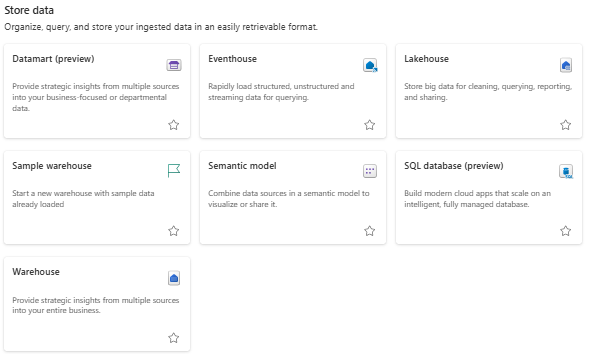

# Store Data

<figure markdown="span">
  
</figure>

While there are many items that can be utilised to store data, the main ones that are used are Lakehouses, SQL databases, semantic model and warehouses.

In this section, these terms will be defined.

## Lakehouse

- A collection of files, folders, and tables that represent a database over a data lake used by Apache Spark engine and SQL engine for big data processing.

- Contains files in various formats (structured and unstructured) organised in folders and subfolders.

For more information, refer to [Using Fabric Tools: Lakehouse](../fabric_tools/lakehouse.md).

### SQL Analytics Endpoint

- Enables the querying of data in the Lakehouse using [T-SQL language](https://learn.microsoft.com/en-us/sql/t-sql/language-reference?view=sql-server-ver16) and [TDS protocol](https://learn.microsoft.com/en-us/openspecs/windows_protocols/ms-tds/b46a581a-39de-4745-b076-ec4dbb7d13ec).

- Every Lakehouse has one SQL Analytics Endpoint.

- This can be used to connect to external sources such as Excel and Power BI reports.

For more information, refer to [SQL Analytics Endpoint](../fabric_tools/sql_endpoint.md).

## Fabric SQL Database

- Developer-friendly transactional database, based on Azure SQL Database, that allows you to easily create your operational database in Fabric.

- Stores data in open-source Delta Lake format.

- SQL database in Fabric creates 3 items in your Fabric workspace:

    - Data in your SQL database is automatically replicated into the OneLake and converted to Parquet, in an analytics-ready format.

    - A SQL analytics endpoint

    - A default semantic model

## Warehouses

- Lake-centric warehouse built on an enterprise-grade distributed processing engine.

- Not a traditional enterprise data warehouse, it is a lake warehouse that supports two distinct warehousing items:

    - Fabric data warehouse

    - SQL analytics endpoint

For more information, refer to [Using Fabric Tools: Warehouse](../fabric_tools/warehouse.md).

## Warehouse, SQL Database, or Lakehouse?

| Data Storage         | **Lakehouse**                              | **Warehouse**                                | **SQL Database**                             |
|--------------------------|--------------------------------------------|-----------------------------------------------|-----------------------------------------------|
| **Data Format**          | Open data formats (Delta/Parquet)          | Proprietary formats optimized for analytics   | Traditional relational formats (e.g., row-based) |
| **Storage**              | OneLake (data lake-based)                  | OneLake (optimized tables)                    | OneLake (relational tables)                   |
| **Schema Enforcement**   | Schema-on-read (flexible)                  | Schema-on-write (strict)                      | Schema-on-write                               |
| **Performance**          | Good for large-scale data, not fastest     | Highly optimized for analytics (fast queries) | Moderate, optimized for transactional access  |
| **Data Type**            | Semi-structured, unstructured, structured  | Structured only                               | Structured only                               |
| **Best For**             | Big data, ML pipelines, raw data           | BI, dashboards, OLAP workloads                | OLTP workloads, simple app-level storage      |
| **Compute Engine**       | Spark-based engine                         | SQL-based compute (dedicated pools)           | Lightweight SQL engine                        |
| **Real-Time Queries**    | Limited support                            | Strong support                                | Moderate support                              |
| **Integration with BI**  | Good, but may need performance tuning      | Excellent (Power BI native)                   | Moderate                                      |
| **Versioning & Lineage**| Built-in Delta Lake versioning             | Limited                                       | Limited                                       |
| **Data Volume**          | Petabyte-scale                             | Terabyte-scale (optimized)                    | Gigabyte-scale                                |
| **Cost Efficiency**      | Efficient for storage-heavy, compute-light | Efficient for performance                     | Efficient for lightweight operations          |
| **Use Cases**            | Data science, ML, raw ingestion, archiving| Business intelligence, reporting, dashboards  | Lightweight apps, transactional needs         |

## Semantic Model

- A semantic model represents a source of data ready for reporting, visualization, discovery, and consumption.

- Typically a star schema with facts that represent a domain, and dimensions that allow you to analyze, or slice and dice the domain to drill down, filter, and calculate different analyses.

- The semantic model is created automatically for you, and you choose which tables, relationships, and measures are to be added, and the business logic gets inherited from the parent lakehouse or Warehouse respectively.

For more information, refer to [Using Fabric Tools: Semantic Model](../fabric_tools/semantic_model.md).

[:material-arrow-left: Get Data](./get_data.md){ .md-button }

[Prepare Data :material-arrow-right:](./prepare_data.md){ .md-button }

